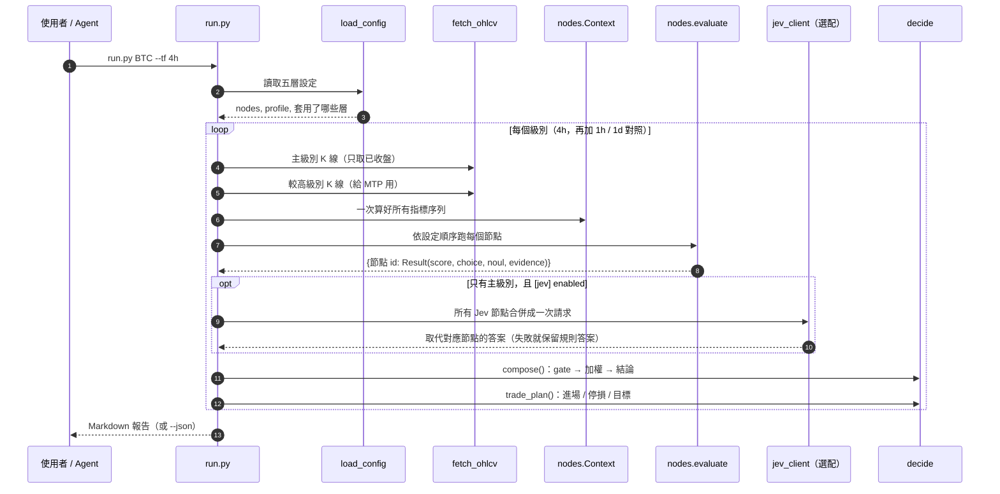
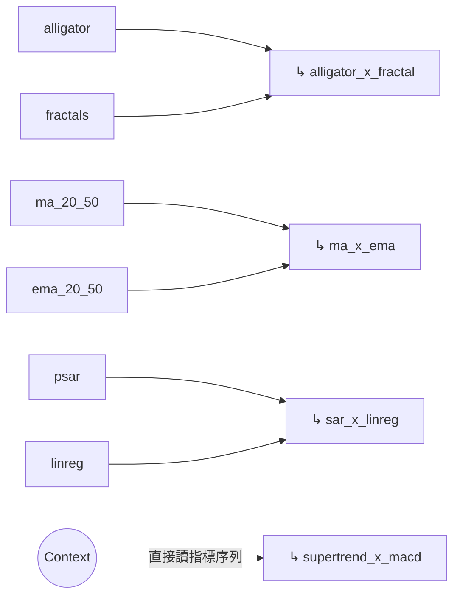
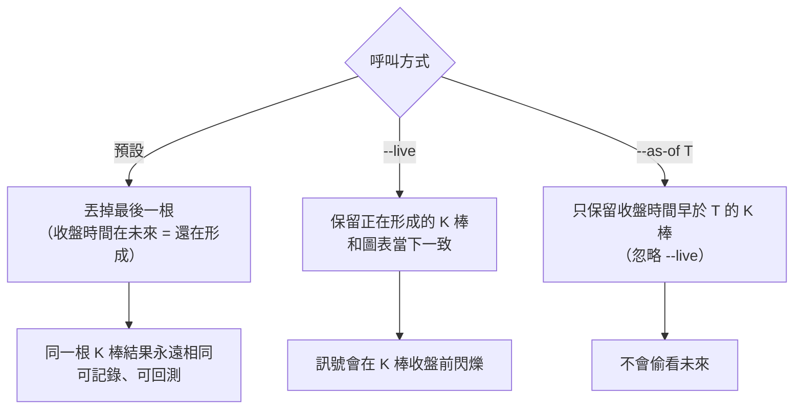

# 01 架構與資料流

> 一句話：**抓 K 線 → 算指標 → 每個檢核項各自判斷 → 用設定檔裡的權重和 gate 合成 → 產生結論與計畫**。每一步只做一件事，後一步不回頭改前一步的答案。

[← 回目錄](README.md)

## 為什麼不再看圖

crypto-watch 原本的檢核流程是「人或 AI 看 TradingView 圖表，逐項打勾」。這有兩個問題：

1. TradingView widget 是跨網域 iframe 裡的 canvas，程式讀不到數值，只能靠截圖辨識，準確度有限。
2. 同一張圖，不同次判讀可能給出不同答案，沒辦法回測，也沒辦法校準。

tv-ta 的決定是：**自己從 Binance K 線把指標算出來**，公式和參數對齊 crypto-watch 圖表上的 TradingView 內建指標。其中 BB、KC、Donchian、SMA、EMA、PSAR、VWMA 已用 tvscreener 驗證，誤差 < 0.1%；MTP、Fractals、Alligator、MA Cross、Volatility Stop、Zig Zag、Supertrend、LinReg 待對照圖表抽查（見 [驗證狀態](../../skills/tv-ta/README.md#驗證狀態)）。同一根 K 棒，每次跑出來的結果都一樣。

注意：預設只用已收盤的 K 棒，圖表則畫到正在形成的那根，所以最新一根的數值會和圖表不同；要一致請加 `--live`（見[下方](#為什麼只用已收盤的-k-棒)）。

## 執行流程

## 模組分工

| 模組 | 職責 | 刻意**不**做的事 |
|---|---|---|
| `fetch_ohlcv.py` | 從 Binance 公開 API 抓 K 線；主機失敗時改用 `data-api.binance.vision` 鏡像 | 不判斷、不快取結果（`--cache` 只快取原始 K 線） |
| `indicators.py` | 純函式，輸入序列、輸出序列，公式對齊 Pine Script | 不知道任何門檻或檢核規則 |
| `nodes.py` | `Context` 一次算好所有指標；每個 `r_xxx` 規則只回答一個檢核項 | 不知道權重、不知道其他級別、不做合成 |
| `jev_client.py` | 把指定節點改問 TypeSafe Jev | 失敗時不中斷，只加警告 |
| `decide.py` | gate 係數、加權平均、檢核表計數、交易計畫 | 不重新判斷任何指標 |
| `run.py` | 讀設定、串起流程、輸出報告與紀錄 | 不寫死任何門檻 |
| `updown.py` | 在 `run.analyse` 之上計算一日漲跌題 P(Up) | 不給下注金額 |

這個切法的好處：**調權重或 gate 只影響 `decide.py` 那一步**。搭配 `--cache`，連 K 線都不必重抓，改動前後的差異只來自設定。

## 節點的輸出：`Result`

每個規則都回傳同一個結構（`scripts/nodes.py`）：

| 欄位 | 型別 | 意思 |
|---|---|---|
| `score` | float 或 None | -2 到 +2；None = 未核對 |
| `choice` | str 或 None | Choice 節點的類別標籤，例如鱷魚的 `sleeping` / `up` / `down` / `mixed` |
| `noul` | float 或 None | gate 節點的 0–1 機率 |
| `evidence` | str | 一行具體數值，報告直接顯示 |
| `data` | dict | 判斷用到的數字；組合項會讀它，也是送給 Jev 的 state |
| `source` | str | `rule` 或 `jev` |

- **`score = None` 不是 WAIT**。它代表資料不足（例如 Zig Zag 轉折點不夠），這一項會標成「未核對」，**不計入分母**。這是「我不知道」和「我知道，答案是中性」的區分，理由見 [02 的信心度一節](02-typesafe-patterns.md#信心度門檻路由confidence-gated-routing)。
- **`evidence` 一定要有數字**。報告每一列都附證據，使用者可以直接對照圖表檢查，不用相信黑盒。
- 規則函式如果丟出 `IndexError`、`ZeroDivisionError` 或 `TypeError`，`evaluate()` 會把該項記為「計算失敗」而不是讓整份報告崩潰。
- 分數最後一律夾在 -2 到 +2。

## 節點的執行順序

`evaluate()` 依 `config/nodes.toml` 的順序執行，並把前面的結果傳給後面的規則。組合項（↳）因此**必須排在它依賴的節點之後**：

`supertrend_x_macd` 是例外：它直接讀 `Context` 裡的 Supertrend 和 MACD 柱，不讀節點答案。因為 MACD 節點的規則要求「連續增高」，而 check.html 的組合項只要求「正值柱」，兩者定義不同。

## 為什麼只用已收盤的 K 棒

- 預設用已收盤 K 棒，是為了讓 `--log` 的紀錄可以拿來回測：如果紀錄裡混了未收盤的 K 棒，事後重算會得到不同答案。
- `--as-of` 必須忽略 `--live`：當時還在形成的 K 棒，今天抓下來已經是完整的，會把未來資訊洩漏給回放。
- **例外**：MTP（多時間框架）用的較高級別 K 線永遠包含當前那根，因為圖表上的顏色方塊就是這樣畫的。回放時仍然會截斷。

## 多級別對照

主級別之外，`[timeframes] context = ["1h", "4h", "1d"]` 的每個級別都會完整跑一次，但：

- 只在報告裡列出分數和結論，**不參與主級別的結論**；
- Jev 只在主級別呼叫，避免一次分析打三次 API。

多級別不一致時，由 agent 在報告後的解讀裡指出（見 `SKILL.md` 第 4 步），而不是由程式自動加權。理由：不同級別的分數代表不同持有期間，直接平均會混淆「短線偏多、長線偏空」這類有用的資訊。一日漲跌題是唯一會平均多級別分數的地方，見 [07](07-updown.md)。

## 結束代碼

| 代碼 | 意思 | Agent 該怎麼做 |
|---|---|---|
| 0 | 成功 | 顯示報告 |
| 2 | 參數或設定錯誤（例如不支援的級別、設定檔寫錯節點 id） | 回報錯誤訊息並停止 |
| 3 | 抓不到行情（網路問題，或 Binance 沒有這個交易對） | 回報錯誤訊息並停止，**不可以用記憶中的數字補** |
