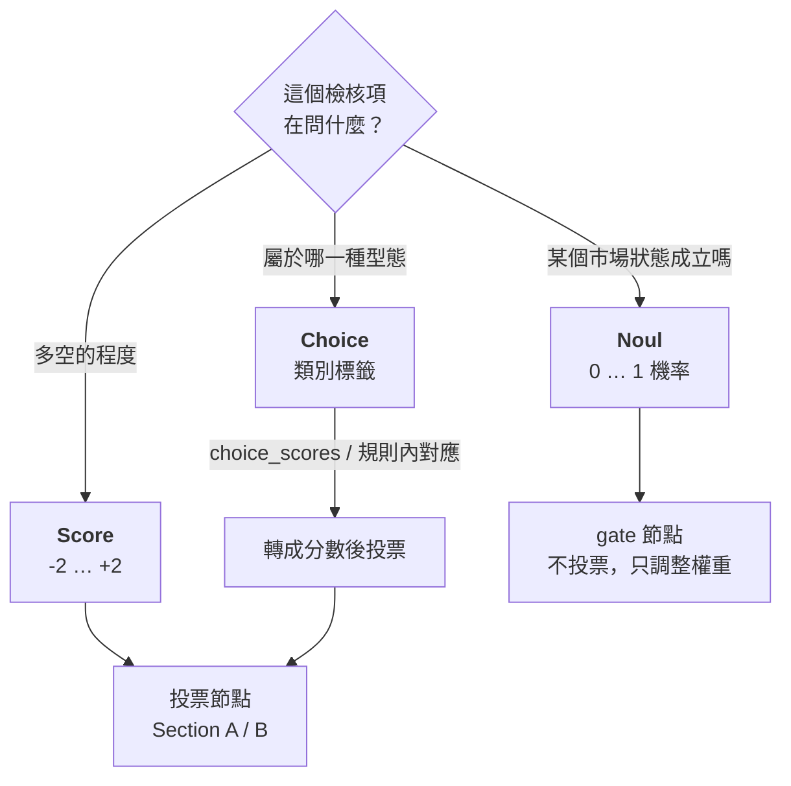
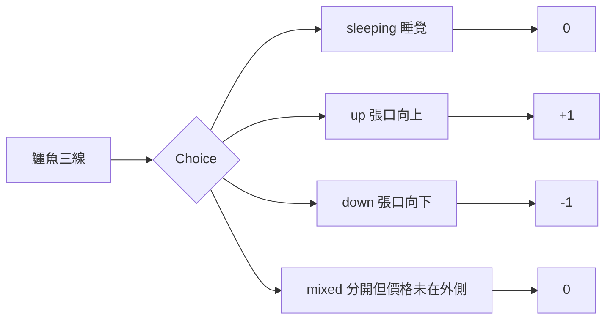
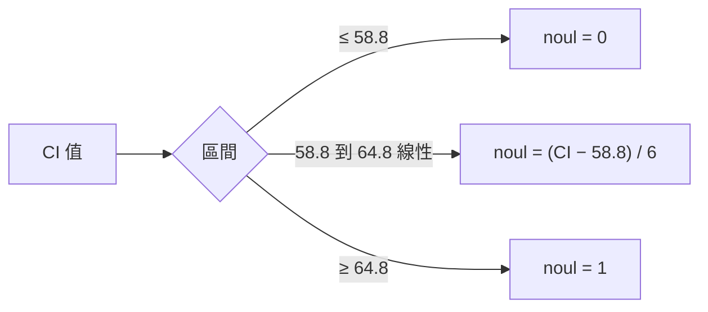
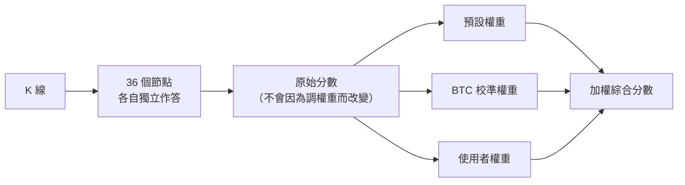
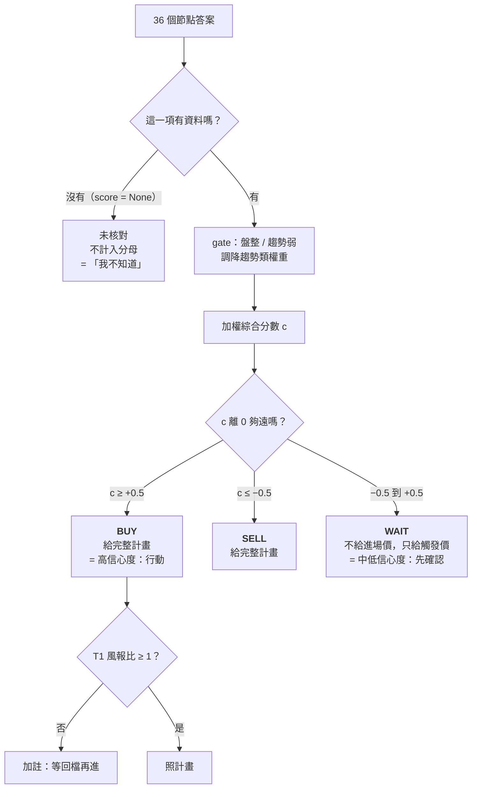
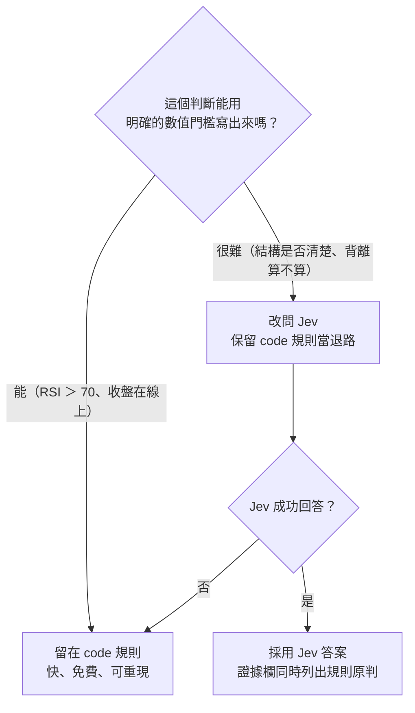

# 02 TypeSafe 設計模式對照

> tv-ta 的決策模型借用 TypeSafe System One 的設計理念，但**預設完全不呼叫 LLM**：每個節點都是 code 規則。TypeSafe 在這裡首先是一種「怎麼切判斷」的方法，其次才是一個可以選配的 API。

[← 回目錄](README.md)

本文每一節先引用 TypeSafe 的原意（中文翻譯見 [skill-typesafe-ai 中文文件](https://github.com/JacobHsu/skill-typesafe-ai/tree/main/docs/llm)），再說明 tv-ta 怎麼對應，最後列出刻意不同的地方。

| TypeSafe 概念 | tv-ta 對應 | 實作狀態 |
|---|---|---|
| [Score](https://docs.typesafe.ai/primitives/score) | 大多數檢核項：-2 到 +2 | ✅ |
| [Choice](https://docs.typesafe.ai/primitives/choice) | 結構分類：鱷魚、碎形、擠壓、均線排列、Zig Zag | ✅（類別 → 分數） |
| [Noul](https://docs.typesafe.ai/primitives/noul) | 盤整、趨勢確立兩個 gate | ✅（軟門檻） |
| [State](https://docs.typesafe.ai/concepts/state) | `Context` 與送給 Jev 的 `data` | ✅ |
| [複合評分](https://docs.typesafe.ai/patterns/composite-scoring) | 加權綜合分數 | ✅ |
| [扇出](https://docs.typesafe.ai/patterns/fan-out) | 36 個節點彼此獨立；Jev 節點合併成一次請求 | ✅ |
| [信心度門檻路由](https://docs.typesafe.ai/patterns/confidence-routing) | 結論死區、未核對、WAIT 只給觸發價、Jev 失敗退回規則、一致度路由（選配） | ⚠️ 部分；一致度路由預設關閉，Jev 的 `confidence` 尚未用來路由 |

---

## 三種問題型別：Score / Choice / Noul

TypeSafe 的原則：**答案的形狀決定問題型別**。光譜上的位置用 Score，固定選項之一用 Choice，是或否用 Noul。

### Score：預設型別

大部分檢核項本質上是「偏多還是偏空，有多強」，所以用 Score。

- **範圍用 -2 到 +2，不是 0 到 4**：零點代表中性，正負號直接就是方向，加權平均後仍然保有「正 = 多、負 = 空」的意義。TypeSafe 的 Score 等級從 0 開始；tv-ta 的 Jev 節點會把第 0 級到第 n−1 級線性對應回 -2 到 +2（`jev_client.py`）。
- **大多數規則只給 -1 / 0 / +1**。只有「強力訊號」組合項（鱷魚 × 碎形）給 ±2。這是刻意的：check.html 的原始描述大多只有「是 / 否」，硬把它拆成五級會製造出不存在的精確度。

### Choice：先分類、再給分

有些指標的圖上判讀本來就是**分類**，不是程度。例如鱷魚線：

為什麼不直接給分數？因為**類別本身有用**：組合項 `alligator_x_fractal` 需要知道「是不是 sleeping」，而 `score = 0` 無法區分「睡覺」和「方向不明」。所以 Choice 節點同時保留 `choice` 標籤和對應的 `score`。

tv-ta 裡的 Choice 節點：`fractals`、`alligator`、`squeeze`、`ma_20_50`、`ema_20_50`、`zigzag`。

### Noul：用機率表達「條件成立嗎」

gate 問的是「現在是盤整嗎」「趨勢確立了嗎」，這是是非題，所以用 Noul。

tv-ta 的關鍵設計是**軟門檻**：不是 `CI > 61.8 → 盤整`，而是在門檻前後一段區間內線性過渡：

理由：硬門檻會讓 CI 從 61.7 變成 61.9 時，整組趨勢指標的權重瞬間砍半，結論可能因為一點點雜訊而翻轉。軟門檻讓權重連續變化。細節見 [03 的 gate 一節](03-decision-model.md#gate用-noul-調整群組權重)。

---

## 複合評分（Composite scoring）

> TypeSafe：「將複雜的判斷拆解成原子化的分數，再用程式碼中可控的權重加以組合。」

這是 tv-ta 最核心的借用。對照 TypeSafe 的履歷篩選範例：

| 履歷篩選範例 | tv-ta |
|---|---|
| 一份履歷 | 一個幣種、一個級別的 K 線 |
| 4 個 Score 問題（Python、領導、設計、通才） | 36 個投票節點 + 2 個 gate |
| 各除以 4 正規化到 0–1 | 已經是 -2 到 +2，不再正規化 |
| 資深 IC / 工程經理兩組權重 | 預設權重 + BTC / ETH 校準權重 + 使用者權重 |
| 依職位排序應徵者 | 依綜合分數給 BUY / WAIT / SELL |

**這個模式帶來的三個好處**：

1. **調參不必重新判斷**：權重在 `decide.py` 才套用。`--cache` 重跑時，節點看到的東西完全一樣，差異只來自設定。
2. **可以解釋**：報告每一列都有「權重」欄，被 gate 調降的會顯示成 `1→0.5`。結論不符預期時，看權重欄就知道是誰拉動的。
3. **可以校準**：`--log` 記下的是**原始分數**，之後可以用不同權重重算歷史，找出哪組權重命中率最高（見 [08](08-config-and-calibration.md)）。

**刻意不同**：TypeSafe 的範例把權重加總設為 100%。tv-ta 用的是**加權平均**（除以有效權重總和），所以權重只有相對大小有意義，調某一項為 2.0 不需要同時調低其他項。

---

## 扇出（Fan-out）與原子化問題

> TypeSafe：把一個大問題拆成許多小問題，在同一次請求中平行回答；每個問題彼此獨立。

tv-ta 的對應：

- **一個節點只做一個判斷**。RSI 節點不知道 MACD 的答案。這避免了「因為 MACD 偏多，所以 RSI 也解讀成偏多」的循環論證。
- **例外是組合項（↳）**：check.html 本來就有「兩者同時成立才算」的項目，所以組合項被允許讀前面節點的答案。它們在設定檔中排在後面。
- **Jev 節點合併成一次請求**：`jev_client.py` 把所有開啟 Jev 的節點打包成一個 `questions` map 一次送出，state 是所有節點的 `evidence` 和 `data`。這正是 TypeSafe 建議的「多個問題放在同一個請求」。

**已知取捨**：「一個節點一個判斷」不代表節點之間**統計上獨立**。例如 Supertrend 同時出現在 A-16、B-1，又被 B-5（Supertrend × MACD）讀取，等於同一條線投了將近三票。這是為了和 check.html 的格子一一對應而保留的，細節見 [03 的已知取捨](03-decision-model.md#已知取捨)。

---

## 信心度門檻路由（Confidence-gated routing）

> TypeSafe：「把信心度當成第二個維度。答案告訴你『是什麼』，信心度告訴你『要不要行動』。」
> 並建議三條路徑：**高信心度自動執行、中信心度謹慎進行、低信心度不要行動**；門檻依「做錯的後果」而定。

TypeSafe 的 `confidence` 是從 LLM 回答的機率分布推導出來的。tv-ta 的預設節點是 code 規則，**沒有機率分布，也就沒有 TypeSafe 意義上的 confidence**。但「依確定程度決定行動強度」這個想法，在 tv-ta 裡用幾種方式實現：

| TypeSafe 路徑 | tv-ta 的對應機制 | 程式位置 |
|---|---|---|
| **低信心度：不要行動** | 資料不足 → 未核對，不當成 WAIT、不進分母 | `nodes.py` 規則回傳 `Result(None, …)` |
| **低信心度：轉交其他系統** | Jev 請求失敗、沒有 API key、回答格式不符 → 退回 code 規則並加警告 | `jev_client.apply` |
| **中信心度：謹慎進行** | 綜合分數在 ±0.5 死區內 → WAIT，只給「收盤站上 X 轉多 / 跌破 Y 轉空」的觸發價，讓市場自己確認 | `decide.compose`、`trade_plan` |
| **中信心度：標記送審** | 檢核表計數和加權分數結論不同時，報告加註提醒 | `run.render` 的 `methods_disagree` |
| **高信心度：自動執行** | BUY / SELL 才給進場區、停損、目標 | `decide.trade_plan` |
| **門檻依風險而定** | 盤整或趨勢弱時，趨勢類的「信心」被 gate 打折 | `profile.toml [[gate]]` |
| **不要假裝確定** | 一日漲跌題的技術面修正上限 ±10pp，報告明說係數未校準 | `profile.toml [updown] max_tilt` |

### 尚未做到的部分

1. **Jev 的 `confidence` 只被記錄，沒有被拿來路由**。`jev_client.py` 會把 `confidence 0.xx` 寫進證據欄，但不論信心度多低都直接採用 Jev 的答案。
2. **加權一致度（agreement）預設不參與結論**。它代表和綜合分數同方向的權重佔多少比例，是 code 版最接近 confidence 的數字。`[decision.routing]` 可以開啟「一致度不足就把 BUY / SELL 降為 WAIT」，但 BTC、ETH 在 1h / 4h / 1d 的回放都看不出它能分出好壞訊號，所以預設關閉。

細節和回放結果見 [03 的信心度路由一節](03-decision-model.md#信心度路由用一致度降級結論)。

---

## State：節點看到什麼

> TypeSafe：state 是要評估的內容；問題的 `instructions` 可以用反引號指向 state 裡的欄位。

- **code 規則的 state** 是 `Context`：同一份 K 線上一次算好的所有指標序列。所有規則讀同一份，保證彼此一致。
- **Jev 的 state** 是所有節點的 `{evidence, **data}`，以節點 id 為鍵。所以 Jev 問題可以寫 `` `zigzag.pivots` ``、`` `rsi.rsi_prev` ``。
- 刻意**不**把原始 K 線送給 Jev：500 根 K 線很長，而且 LLM 不擅長自己算指標。送出的是已經算好的數字，讓 Jev 只做「解讀」這一步。

## 什麼時候該改用 Jev

TypeSafe 官方的建議，也是 tv-ta 的原則：

目前唯一附上 Jev 範例（預設停用）的是 Zig Zag：「高低點遞升 / 遞降」用兩個點比較很粗糙，問 Jev「這些轉折點形成的趨勢結構有多清楚」更接近人看圖的判讀。設定方式見 [08](08-config-and-calibration.md#jev-節點)。
