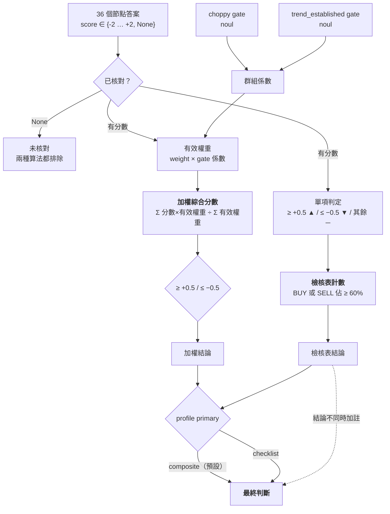
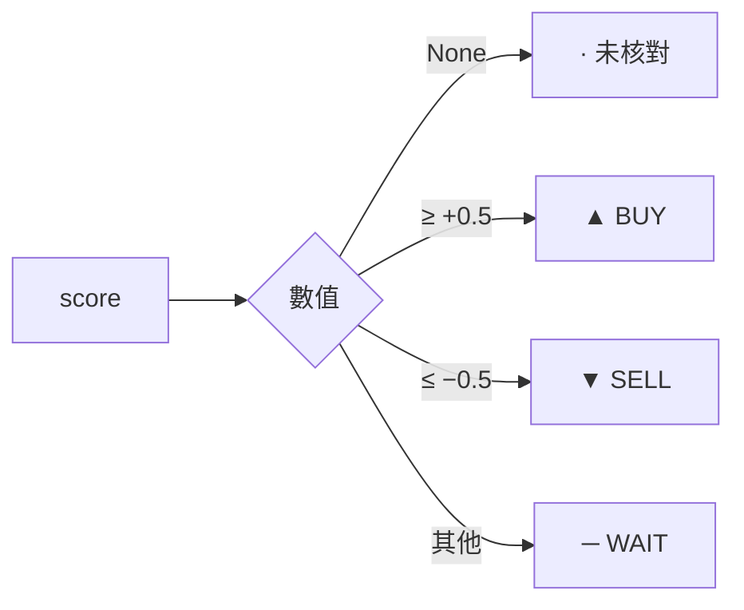
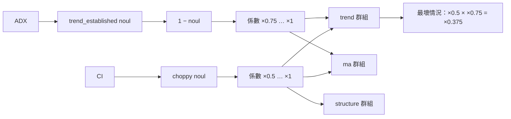
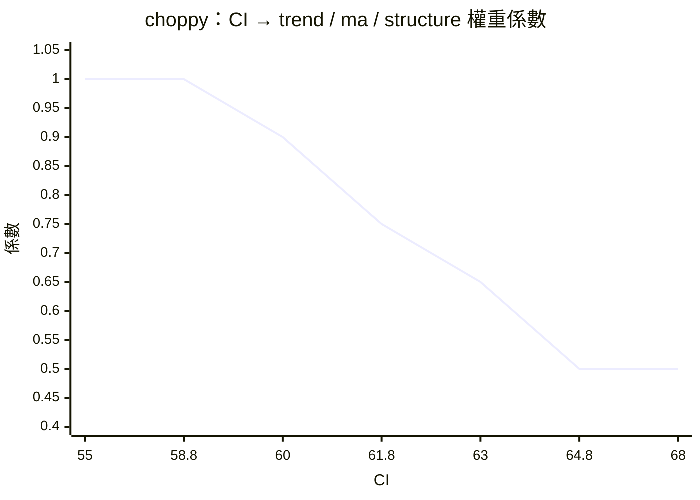
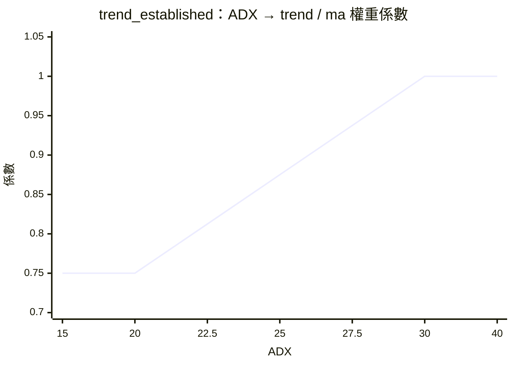
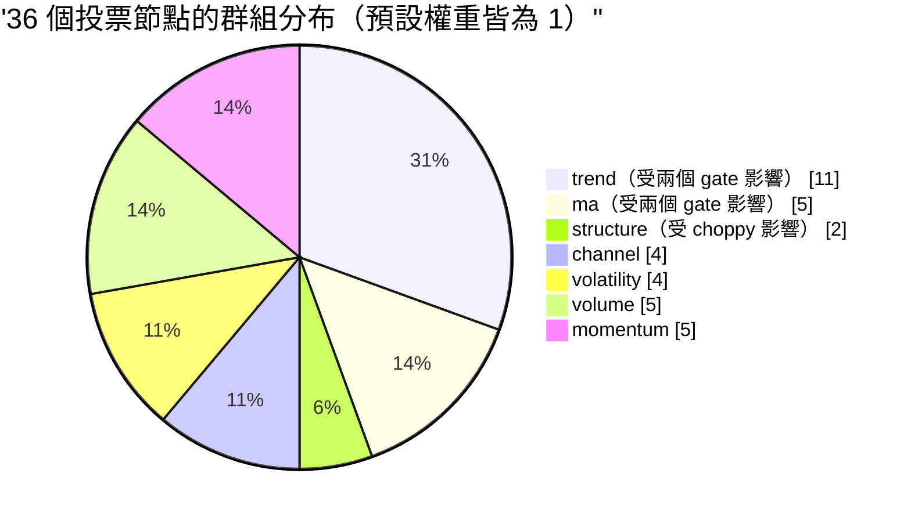
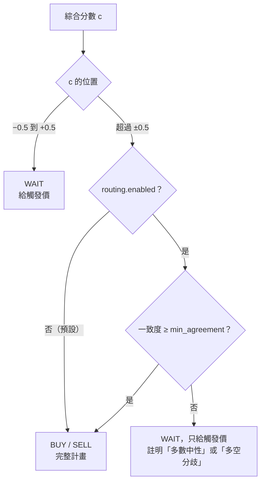
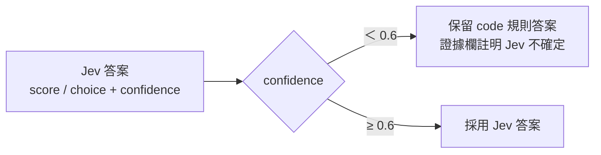

# 03 決策模型

> 節點只負責「看到什麼」，這一層負責「該怎麼辦」。所有政策（權重、gate、門檻）都在設定檔裡，程式碼在 `scripts/decide.py`。

[← 回目錄](README.md)

## 全貌



## 兩種算法並存

| | 檢核表計數 | 加權綜合分數 |
|---|---|---|
| 來源 | check.html 原本的規則 | TypeSafe 複合評分 |
| 算法 | 已核對項目中 ▲ 或 ▼ 佔 ≥ 60% 才成立 | 分數的加權平均，範圍 -2 到 +2 |
| 看不看權重 | 不看，每項一票 | 看，也套用 gate |
| 看不看強度 | 不看，+2 和 +1 都只算一個 ▲ | 看，+2 的影響是 +1 的兩倍 |
| 用途 | 和人工檢核對照、確認沒有偏離原始流程 | **預設的最終判斷** |

**為什麼兩個都保留**：檢核表計數是使用者熟悉的「36 項裡幾項打勾」；加權分數才能吸收校準結果。兩者並列，結論不同時報告會提示「權重或 gate 改變了結果」，讓使用者知道差異從哪來，而不是只看到一個被悄悄改掉的結論。

**為什麼預設用加權分數**：檢核表計數有兩個結構性問題：

1. **60% 門檻太高**：36 項裡有很多項在沒有訊號時就是 0（例如 Donchian 沒突破、Stoch RSI 沒交叉），所以即使趨勢很明確，▲ 也很難過 60%。
2. **無法校準**：回測顯示某些指標對 BTC 沒有 edge（見 [08](08-config-and-calibration.md)），計數法沒辦法降低它們的影響。

## 單項判定



門檻 `signal_threshold = 0.5` 在 `[decision]`。目前規則多半給整數分數，所以實際效果是「非零就算訊號」；這個門檻是為 Jev 節點預留的：Jev Score 會回傳連續值（例如 +0.3），落在 ±0.5 之內就不算訊號。

## 加權綜合分數

```
有效權重ᵢ = weightᵢ × Π(該節點群組的 gate 係數)
綜合分數  = Σ(scoreᵢ × 有效權重ᵢ) ÷ Σ(有效權重ᵢ)     ← 只算已核對且有效權重 > 0 的節點
```

- **除以權重總和**：權重只有相對大小有意義。把 UO 設成 2.0 就是「UO 的影響是一般節點的兩倍」，不用同時調低其他節點。
- **gate 會同時縮小分子和分母**：被 gate 打折的群組，影響力相對其他群組下降，但綜合分數仍然在 -2 到 +2。
- **`weight = 0`**：這一列照樣顯示和計入檢核表計數，但不參與加權。適合「想看但不想讓它投票」的指標。
- **`enabled = false`**：完全不計算（Aroon、ROC 目前如此，見 [05](05-nodes-section-b.md#停用節點)）。
- **Section E 事件節點**：事件沒發生（分數 0）時標為「· 未觸發」，有效權重視為 0，**不進分母**，否則每多一個偶爾才觸發的節點，綜合分數就會被往 0 拉。事件發生時照一般節點投票。事件節點不是 check.html 的格子，所以永遠不計入檢核表計數，也不算在「已核對 N / 36」裡。見 [09](09-event-nodes.md)。

### 結論門檻

| 綜合分數 | 結論 |
|---|---|
| ≥ `buy_above`（+0.5） | BUY |
| ≤ `sell_below`（−0.5） | SELL |
| 其他 | WAIT |

**為什麼是 ±0.5**：在全部權重相同、分數只有 ±1 / 0 的情況下，+0.5 大約等於「多方票比空方票多出全部票數的一半」。這是一個保守的起點，還沒經過回測校準。

### 加權一致度（agreement）

```
一致度 = 和綜合分數同號的有效權重 ÷ 全部有效權重
```

分數為 0 的節點算在分母裡，所以一致度低可能代表「很多項中性」，不一定是「多空打架」。報告會把權重拆成同向、中性、反向三塊一起列出。預設**只顯示、不參與結論**；可以選擇開啟用它降級結論，見下方[信心度路由](#信心度路由用一致度降級結論)。

## Gate：用 Noul 調整群組權重

gate 節點不投票，只回答「某個市場狀態成立的機率」，再依 `profile.toml [[gate]]` 調降整個群組的權重：

```
p    = noul              （invert = true 時用 1 − noul）
係數 = 1 − p × (1 − floor)
```

一個群組被多個 gate 影響時，係數相乘。

| Gate | 問題 | 影響群組 | floor | 依據 |
|---|---|---|---|---|
| `choppy` | 現在是盤整嗎？（CI） | trend、ma、structure | 0.5 | CHECK.md：CI > 61.8 時趨勢型指標可靠度下降 |
| `trend_established` | 趨勢確立了嗎？（ADX，invert） | trend、ma | 0.75 | ADX < 25 時順勢訊號較不可靠 |



### choppy gate：CI 對權重係數

`threshold = 61.8`、`soft_band = 3`：CI 從 58.8 到 64.8 線性過渡。



### trend_established gate：ADX 對權重係數

`threshold = 25`、`soft_band = 5`、`invert = true`：ADX 從 20 到 30 線性過渡。



### 設計理由

- **為什麼調權重而不是直接否決**：盤整時趨勢指標不是完全無效，只是較不可靠。砍到 0 會讓報告在盤整時完全忽略趨勢，而盤整往往正是趨勢將要啟動的時候。
- **為什麼用軟門檻**：CI 61.7 和 61.9 在市場上沒有實質差別，不應該讓結論跳動。
- **為什麼 choppy 比 trend_established 下手重**（0.5 vs 0.75）：CHECK.md 明文要求 CI 盤整時調降趨勢權重；ADX 的門檻則是經驗值，而且 `dmi` 節點本身已經在 ADX ≤ 25 時給 0，不想重複懲罰太多。
- **為什麼 gate 不影響 momentum、volume、channel**：震盪指標（RSI、UO、MFI）在盤整時反而更有用；量能和通道本身不假設有趨勢。

### 各群組成員



| 群組 | 節點 |
|---|---|
| trend | `mtp` `alligator` `alligator_x_fractal` `psar` `vol_stop` `supertrend` `linreg` `sar_x_linreg` `supertrend_b` `dmi` `supertrend_x_macd` |
| ma | `ma_cross` `ma_20_50` `ema_20_50` `ma_x_ema` `hma` |
| structure | `fractals` `zigzag` |
| channel | `bb` `kc` `donchian` `bb_b` |
| volatility | `squeeze` `atr` `choppiness` `hv` |
| volume | `vwma` `vwma_b` `obv` `mfi` `cmf` |
| momentum | `macd` `cci` `rsi` `stoch_rsi` `uo` |

趨勢和均線合計 16 / 36，佔將近一半。這是 check.html 本身的組成，也是 gate 存在的主要理由：沒有 gate，盤整時會有一半的票來自不可靠的指標。

## 實例：BTC 4h，2026-09-22 16:00 UTC 回放

```
python scripts/run.py BTC --tf 4h --as-of 2026-09-22T16:00 --no-user-config
```

| 項目 | 值 |
|---|---|
| 收盤 | 86,413.1 |
| Gate | CI 30.5 → choppy 0.00（×1.00）；ADX 49.2 → trend_established 1.00（×1.00） |
| 檢核表 | ▲ 20 / ─ 13 / ▼ 3，BUY 56% → **WAIT**（差 4 個百分點） |
| 加權綜合分數 | **+0.43**，一致度 52% → **WAIT**（差 0.07） |
| 1h 對照 | +0.46 → WAIT |

解讀：

- 兩個 gate 都沒有作用（強趨勢、不盤整），所以權重只有 BTC 校準的差異（PSAR、DMI、均線類 ×0.5，UO ×2）。
- 趨勢類幾乎全是 ▲，但 RSI 76.6、MFI 85.1 超買給了 ▼，加上 BTC 校準把 UO 權重提高到 2（此時 UO 中性，貢獻 0 但佔分母），拉低了綜合分數。
- 這是「趨勢強但過熱」的典型 WAIT：校準過的權重讓超買訊號有足夠份量抵消趨勢票。報告會給轉多 / 轉空觸發價，而不是進場價。

## 信心度路由：用一致度降級結論

> 目的是對應 TypeSafe 的[信心度門檻路由](02-typesafe-patterns.md#信心度門檻路由confidence-gated-routing)：答案說「是什麼」，信心度說「要不要行動」。code 規則沒有 Jev 那種 confidence，這裡用加權一致度代替。

### 已實作（預設關閉）



```toml
# profile.toml
[decision.routing]
enabled = false
min_agreement = 0.6
```

- 降級的原因依權重分布判斷：反向權重多於中性權重時寫「多空分歧」，否則寫「多數中性，訊號不足」。
- 報告和 `--json` 都保留路由前的結論（`raw_composite_verdict`）；`--log` 同時記錄一致度和路由前的結論，事後可以用任何門檻重算。
- 「檢核表計數與加權分數結論不同」的提醒，比對的是路由前的結論，因為它要說明的是權重和 gate 的影響，不是路由的影響。

### 為什麼預設關閉：回放結果

`scripts/replay.py` 把過去每一根 K 棒當成最新一根重跑，記下 BUY / SELL 當時的一致度和之後 24 小時的漲跌。命中 = 漲跌方向和結論相同。

| 幣種 · 級別 | 期間 | 不路由：次數 / 命中 | 門檻 0.6：保留 / 命中 | 門檻 0.6：被降級的命中 |
|---|---|---|---|---|
| BTC · 1h | 2026-05 起 3000 根 | 566 / 51% | 350 / 52% | 50% |
| BTC · 4h | 2025-10 起 2000 根 | 366 / 47% | 241 / 47% | 47% |
| BTC · 1d | 2024-01 起 1000 根 | 183 / 54% | 135 / 53% | 56% |
| ETH · 1h | 2026-05 起 3000 根 | 448 / 52% | 290 / 52% | 51% |
| ETH · 4h | 2025-10 起 2000 根 | 338 / 45% | 230 / 43% | 48% |
| ETH · 1d | 2023-12 起 1000 根 | 208 / 51% | 144 / 54% | 44% |

- 只看 BTC 4h 最近 66 天時，門檻 0.6 把命中率從 50% 拉到 59%；拉長期間、換幣種和級別之後，這個差距就不見了。保留和被降級的命中率都在 45%–55% 之間，看不出一致度能分出好壞訊號。
- 另一個發現是：**不路由時的 BUY / SELL 本身命中率就接近 50%**。要改善結論，先要處理的是節點與權重，不是路由門檻。
- 相鄰 K 棒的 24 小時區間互相重疊，實際有效樣本比表中的次數少。

重跑：`python scripts/replay.py BTC --tf 4h --bars 2000`（`--thresholds` 可以一次比較多個門檻，`--json` 輸出每一筆訊號）。

### 尚未實作

以下是原本提案裡的其他部分，還沒做，也要先回放驗證：

```toml
strong_above = 0.8           # |c| 超過此值直接給完整計畫
confirm_with_htf = true      # 0.5 ≤ |c| < 0.8 時，要求較高級別同號才給完整計畫

[jev]
min_confidence = 0.6         # Jev 答案信心度低於此值時，退回 code 規則
```

Jev 的部分可以直接比照 TypeSafe 範例：



## 已知取捨

| 取捨 | 影響 | 為什麼保留 |
|---|---|---|
| **重複節點**：Supertrend（A-16、B-1）、Bollinger（A-6、B-10）、VWMA（A-19、B-14）各出現兩次 | 這三個指標實際上是兩票；Supertrend 還被 B-5 讀取，接近三票 | 和 check.html 的格子一一對應，使用者可以逐格對照。要去重可以把 `_b` 節點的 `weight` 設為 0 |
| **組合項和來源相關**：↳ 項在兩個來源都同向時才給分 | 同向時等於多投一票，放大共識 | check.html 就是這樣設計的，「共振」本來就該加分 |
| **大量中性分數** | 綜合分數被 0 稀釋，很少超過 ±1 | 0 代表「此指標目前沒有訊號」，這本身是資訊，不應該排除 |
| **`squeeze` 算出 noul 但沒有 gate 使用** | 擠壓狀態只以 0 分投票 | 保留欄位，未來可以做「擠壓中調降通道類權重」的 gate |
| **±0.5 門檻未校準** | 結論的敏感度是經驗值 | 需要 `--log` 紀錄累積後再回測 |
