# 04 Section A 逐項決策（`{symbol}.html`，19 項）

> 每一項：它看什麼、決策流程圖、為什麼這樣判斷、可以調哪些參數。規則程式碼在 `scripts/nodes.py`，參數在 `config/nodes.toml`。

[← 回目錄](README.md)　｜　[Section B →](05-nodes-section-b.md)

## 共通約定

- 分數：-2 到 +2。≥ +0.5 算 ▲，≤ −0.5 算 ▼，資料不足回傳「未核對」。
- 「收盤」一律指**最後一根已收盤 K 棒**的收盤價（`--live` 時是正在形成的那根）。
- 指標參數預設對齊 TradingView 內建值，改在 `profile.toml [indicators]`；判斷門檻改在各節點的 `params`。
- 每一項的標題列出：節點 id · 型別 · 群組 · 預設權重（BTC / ETH 校準後的權重若不同會另外標出）。

整個 Section A 的欄位分布：

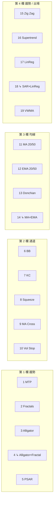
```mermaid
flowchart LR
    subgraph c1["第 1 欄 趨勢"]
        direction TB
        a1["1 MTP"] ~~~ a2["2 Fractals"] ~~~ a3["3 Alligator"] ~~~ a4["4 ↳ Alligator×Fractal"] ~~~ a5["5 PSAR"]
    end
    subgraph c2["第 2 欄 通道"]
        direction TB
        a6["6 BB"] ~~~ a7["7 KC"] ~~~ a8["8 Squeeze"] ~~~ a9["9 MA Cross"] ~~~ a10["10 Vol Stop"]
    end
    subgraph c3["第 3 欄 均線"]
        direction TB
        a11["11 MA 20/50"] ~~~ a12["12 EMA 20/50"] ~~~ a13["13 Donchian"] ~~~ a14["14 ↳ MA×EMA"]
    end
    subgraph c4["第 4 欄 趨勢 / 出場"]
        direction TB
        a15["15 Zig Zag"] ~~~ a16["16 Supertrend"] ~~~ a17["17 LinReg"] ~~~ a18["18 ↳ SAR×LinReg"] ~~~ a19["19 VWMA"]
    end
```

---

## A-1 Multi-Time Period 多時間框架

`mtp` · Score · trend · 1.0

**看什麼**：圖表上方的彩色方塊，代表較高級別最近幾根 K 棒是綠還是紅。較高級別的對應在 `profile.toml [timeframes.htf]`：15m→4h、1h→1d、4h→1w、1d→1M。

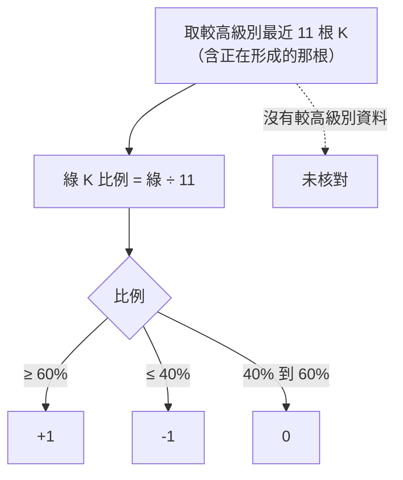
```mermaid
flowchart TD
    s["取較高級別最近 11 根 K<br/>（含正在形成的那根）"] --> r["綠 K 比例 = 綠 ÷ 11"]
    r --> q{"比例"}
    q -- "≥ 60%" --> p["+1"]
    q -- "≤ 40%" --> n["-1"]
    q -- "40% 到 60%" --> z["0"]
    s -. "沒有較高級別資料" .-> u["未核對"]
```

**設計決策**
- **包含正在形成的較高級別 K 棒**：圖上的方塊就是這樣畫的，而且 1w 的一根要等一週才收盤，排除它會讓訊號落後太多。回放時仍然會截斷。
- **11 根、60%**：對應圖上方塊的數量；60% 和 check.html 的多數門檻一致。
- 只看顏色（收 ＞ 開），不看漲跌幅。圖上方塊也只有顏色。

**參數**：`count = 11`、`majority = 0.6`

---

## A-2 Williams Fractals 威廉碎形

`fractals` · Choice · structure · 1.0

**看什麼**：△（上碎形，局部高點）和 ▽（下碎形，局部低點）有沒有被收盤突破。

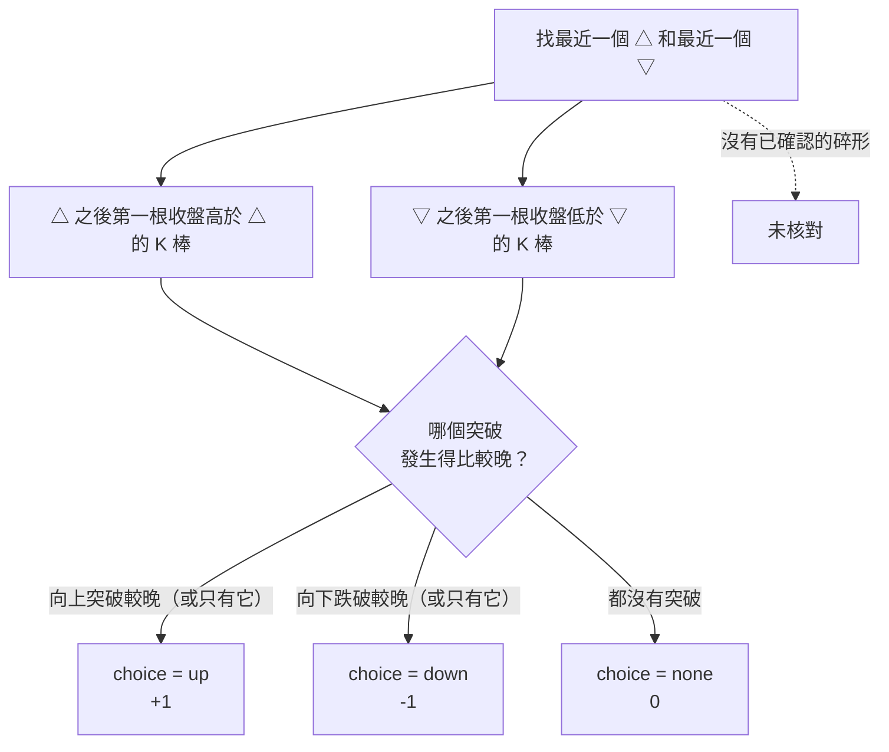
```mermaid
flowchart TD
    s["找最近一個 △ 和最近一個 ▽"] --> b1["△ 之後第一根收盤高於 △ 的 K 棒"]
    s --> b2["▽ 之後第一根收盤低於 ▽ 的 K 棒"]
    b1 --> q{"哪個突破<br/>發生得比較晚？"}
    b2 --> q
    q -- "向上突破較晚（或只有它）" --> up["choice = up<br/>+1"]
    q -- "向下跌破較晚（或只有它）" --> dn["choice = down<br/>-1"]
    q -- "都沒有突破" --> no["choice = none<br/>0"]
    s -. "沒有已確認的碎形" .-> u["未核對"]
```

**設計決策**
- **碎形本身不是訊號，被突破才是**。這是 Bill Williams 的原意，也是 check.html 的描述。
- **以「較晚發生的突破」為準**：兩邊都被突破時，最新的方向代表目前狀態。
- **碎形需要右側 2 根確認**（`fractals.periods = 2`），所以最新的碎形最少是 2 根前的。左側允許最多 4 根等高 K 棒，和 TradingView 的畫法一致。
- 型別是 Choice，因為 A-4 組合項需要知道 `up` / `down` 狀態本身。

---

## A-3 Williams Alligator 威廉鱷魚

`alligator` · Choice · trend · 1.0

**看什麼**：三條平滑移動平均（藍 jaw 13/8、紅 teeth 8/5、綠 lips 5/3，以 hl2 為來源並往右位移）的排列和張口大小。

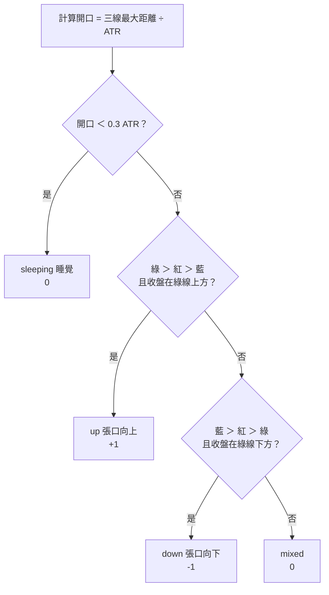
```mermaid
flowchart TD
    s["計算開口 = 三線最大距離 ÷ ATR"] --> q1{"開口 ＜ 0.3 ATR？"}
    q1 -- "是" --> sl["sleeping 睡覺<br/>0"]
    q1 -- "否" --> q2{"綠 ＞ 紅 ＞ 藍<br/>且收盤在綠線上方？"}
    q2 -- "是" --> up["up 張口向上<br/>+1"]
    q2 -- "否" --> q3{"藍 ＞ 紅 ＞ 綠<br/>且收盤在綠線下方？"}
    q3 -- "是" --> dn["down 張口向下<br/>-1"]
    q3 -- "否" --> mx["mixed<br/>0"]
```

**設計決策**
- **「睡覺」用 ATR 正規化的開口判斷**：直接用價差的話，BTC 和小幣的門檻會差好幾個數量級。除以 ATR 讓同一個門檻適用所有幣種和級別。
- **要求收盤在綠線外側**：三線排好但價格已經回到線內，代表「張口」正在收合，不算。
- 四種狀態分開保留，因為 A-4 需要區分「睡覺」和「方向不明」。

**參數**：`min_spread_atr = 0.3`

---

## A-4 ↳ Alligator × Fractal 鱷魚確認碎形

`alligator_x_fractal` · Score · trend · 1.0 · **組合項**

**看什麼**：A-3 和 A-2 的答案。這是 Section A 唯一會給 ±2 的項目。

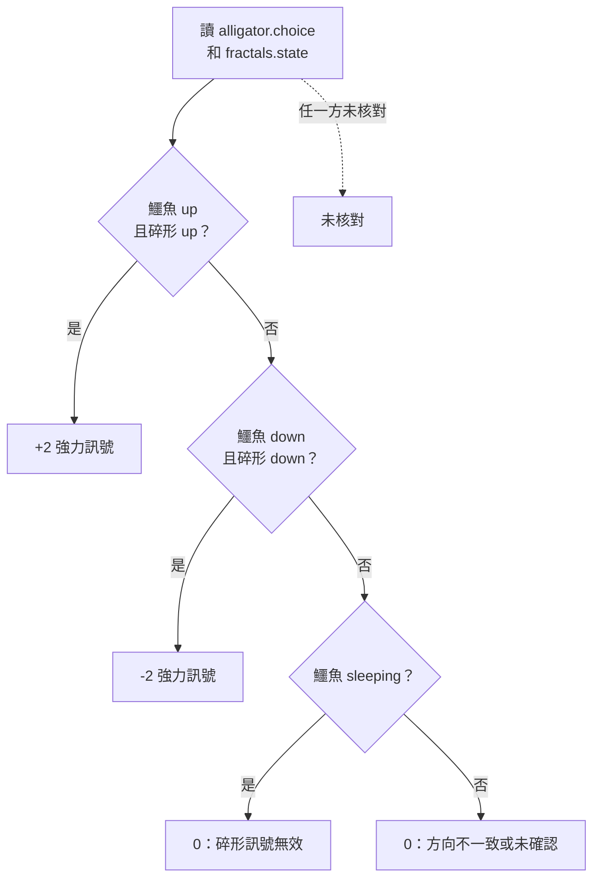
```mermaid
flowchart TD
    s["讀 alligator.choice<br/>和 fractals.state"] --> q1{"鱷魚 up<br/>且碎形 up？"}
    q1 -- "是" --> p2["+2 強力訊號"]
    q1 -- "否" --> q2{"鱷魚 down<br/>且碎形 down？"}
    q2 -- "是" --> n2["-2 強力訊號"]
    q2 -- "否" --> q3{"鱷魚 sleeping？"}
    q3 -- "是" --> z1["0：碎形訊號無效"]
    q3 -- "否" --> z2["0：方向不一致或未確認"]
    s -. "任一方未核對" .-> u["未核對"]
```

**設計決策**
- **±2 是刻意的**：Bill Williams 的交易系統中，「鱷魚張口 + 碎形突破」是主要進場訊號，check.html 標記為強力訊號。
- **鱷魚睡覺時碎形無效**：這是原始系統的規則，盤整中的碎形突破多半是假突破。
- 只有兩者都同向才給分；單邊成立已經在 A-2、A-3 各自投過票了。

---

## A-5 Parabolic SAR 拋物線停損

`psar` · Score · trend · 1.0（**BTC 0.5**）

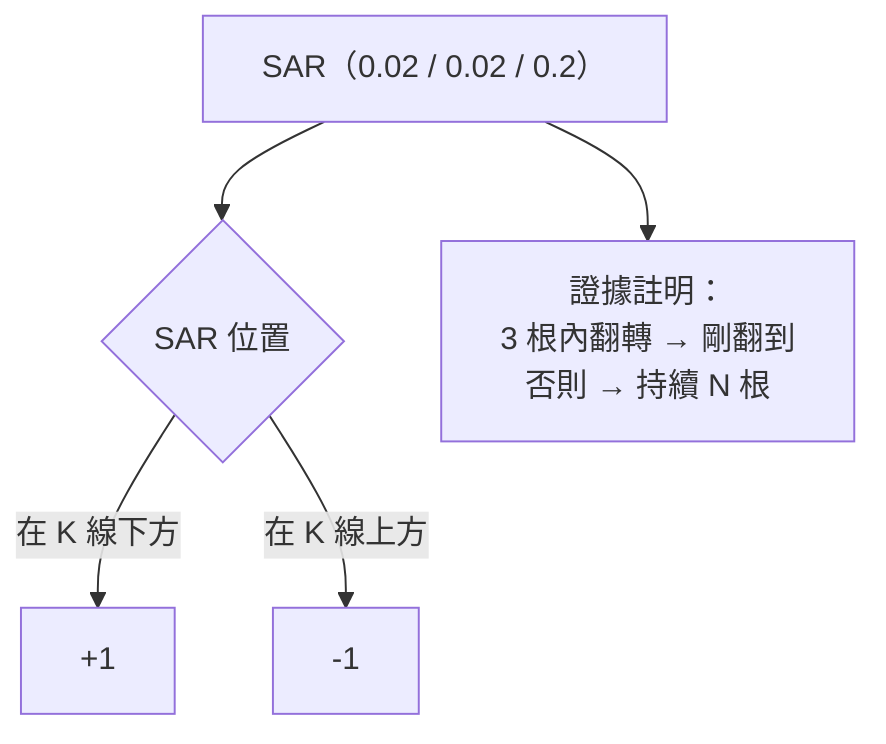
```mermaid
flowchart TD
    s["SAR（0.02 / 0.02 / 0.2）"] --> q{"SAR 位置"}
    q -- "在 K 線下方" --> p["+1"]
    q -- "在 K 線上方" --> n["-1"]
    s --> f["證據註明：<br/>3 根內翻轉 → 剛翻到<br/>否則 → 持續 N 根"]
```

**設計決策**
- **只看位置，不看剛不剛翻轉**：翻轉資訊寫在證據裡，給人看；分數保持簡單。
- 實作是 Pine `ta.sar` 的移植，包含「SAR 不得進入前兩根 K 棒範圍」的限制。
- **BTC 權重 0.5**：回測中 SAR 方向對 BTC 次日漲跌幾乎沒有 edge。

**參數**：`fresh_bars = 3`（只影響證據文字）

---

## A-6 Bollinger Bands 布林通道

`bb` · Score · channel · 1.0（B-10 `bb_b` 同規則）

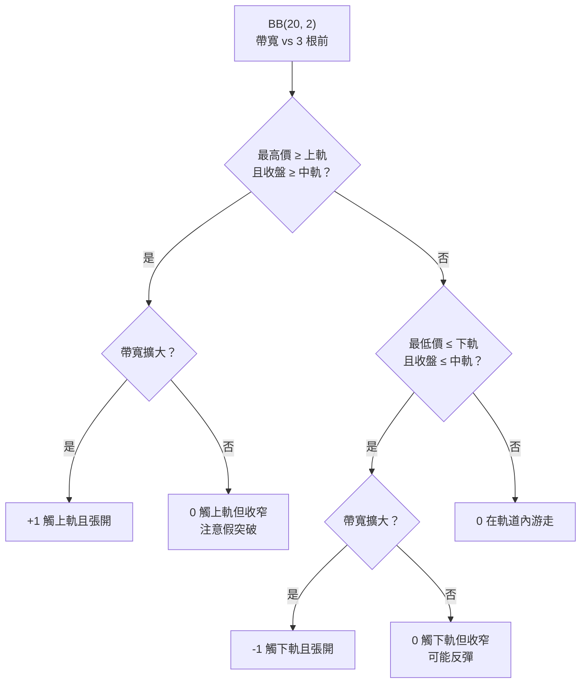
```mermaid
flowchart TD
    s["BB(20, 2)<br/>帶寬 vs 3 根前"] --> q1{"最高價 ≥ 上軌<br/>且收盤 ≥ 中軌？"}
    q1 -- "是" --> e1{"帶寬擴大？"}
    e1 -- "是" --> p["+1 觸上軌且張開"]
    e1 -- "否" --> z1["0 觸上軌但收窄<br/>注意假突破"]
    q1 -- "否" --> q2{"最低價 ≤ 下軌<br/>且收盤 ≤ 中軌？"}
    q2 -- "是" --> e2{"帶寬擴大？"}
    e2 -- "是" --> n["-1 觸下軌且張開"]
    e2 -- "否" --> z2["0 觸下軌但收窄<br/>可能反彈"]
    q2 -- "否" --> z3["0 在軌道內游走"]
```

**設計決策**
- **「觸碰」用最高 / 最低價，不用收盤**：圖上看到的「碰到上軌」是影線碰到。
- **同時要求收盤在中軌同側**：避免長上影線、收在中軌下方的 K 棒被當成強勢。
- **帶寬必須擴大才算**：通道收窄時碰軌，往往是區間震盪的邊緣，順勢解讀會出錯。這是 check.html 的「觸上軌 + 開口」條件。
- 布林在這裡是**順勢**解讀（沿上軌走 = 強），不是均值回歸。

**參數**：`width_lookback = 3`

---

## A-7 Keltner Channel 肯特納通道

`kc` · Score · channel · 1.0

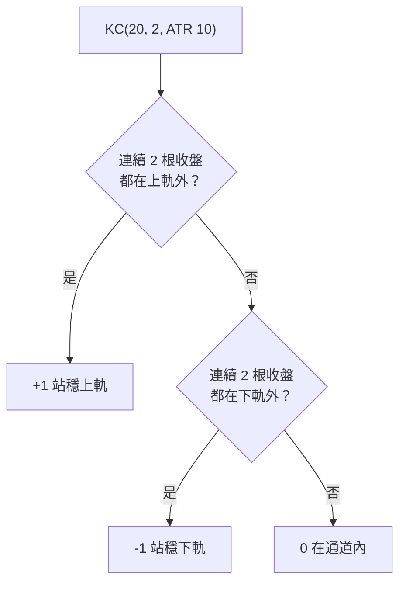
```mermaid
flowchart TD
    s["KC(20, 2, ATR 10)"] --> q1{"連續 2 根收盤<br/>都在上軌外？"}
    q1 -- "是" --> p["+1 站穩上軌"]
    q1 -- "否" --> q2{"連續 2 根收盤<br/>都在下軌外？"}
    q2 -- "是" --> n["-1 站穩下軌"]
    q2 -- "否" --> z["0 在通道內"]
```

**設計決策**
- CHECK.md 的「站穩」翻譯成「連續 N 根收在外側」。一根收在外面可能只是插針；兩根才代表有人接手。
- 和布林不同，KC 用 ATR 做寬度，較不受單根大 K 影響，所以不另外檢查寬度變化。

**參數**：`hold_bars = 2`

---

## A-8 BB / KC Squeeze 擠壓

`squeeze` · Choice · volatility · 1.0

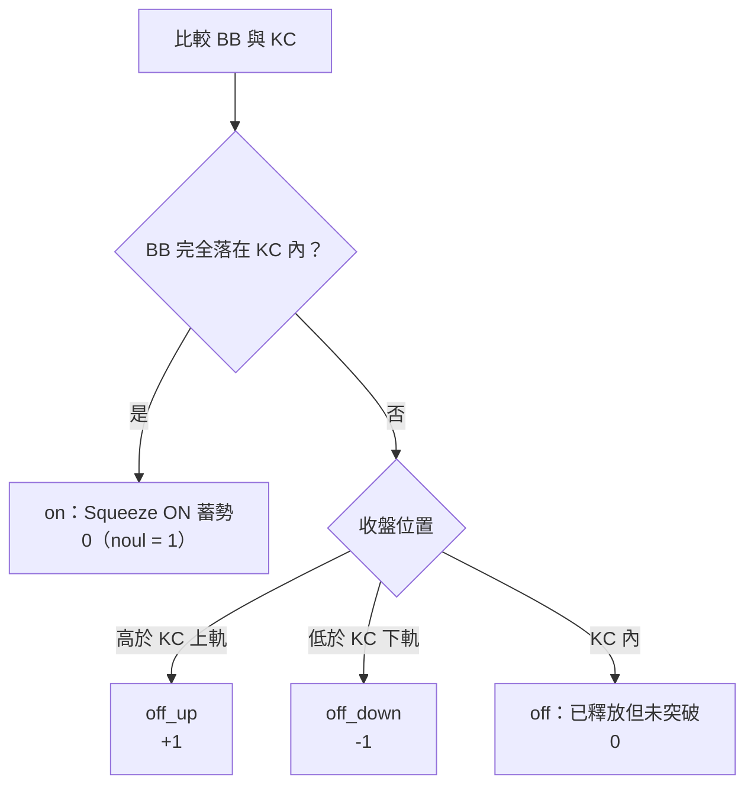
```mermaid
flowchart TD
    s["比較 BB 與 KC"] --> q1{"BB 完全落在 KC 內？"}
    q1 -- "是" --> on["on：Squeeze ON 蓄勢<br/>0（noul = 1）"]
    q1 -- "否" --> q2{"收盤位置"}
    q2 -- "高於 KC 上軌" --> up["off_up<br/>+1"]
    q2 -- "低於 KC 下軌" --> dn["off_down<br/>-1"]
    q2 -- "KC 內" --> off["off：已釋放但未突破<br/>0"]
```

**設計決策**
- **擠壓中不給方向**：擠壓只說「快要動了」，沒說往哪動。
- **釋放後要突破 KC 才給方向**：BB 走出 KC 只代表波動放大，價格真的走出 KC 才是方向確認。
- 節點同時輸出 `noul`（擠壓中 = 1），但目前沒有 gate 使用它（見 [03 已知取捨](03-decision-model.md#已知取捨)）。
- 群組是 volatility，不受趨勢 gate 影響。

---

## A-9 MA Cross 均線交叉

`ma_cross` · Score · ma · 1.0（**BTC / ETH 0.5**）

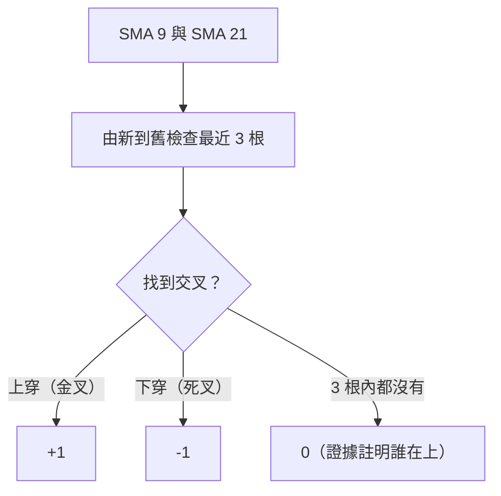
```mermaid
flowchart TD
    s["SMA 9 與 SMA 21"] --> lp["由新到舊檢查最近 3 根"]
    lp --> q{"找到交叉？"}
    q -- "上穿（金叉）" --> p["+1"]
    q -- "下穿（死叉）" --> n["-1"]
    q -- "3 根內都沒有" --> z["0（證據註明誰在上）"]
```

**設計決策**
- **只看「最近發生的交叉」，不看相對位置**：相對位置已經由 A-11 / A-12 的排列表達，這裡只負責「事件」。
- **3 根的回看窗**：交叉當根不一定剛好是最後一根；給 3 根的緩衝，避免訊號只存在一瞬間。
- **BTC / ETH 權重 0.5**：回測中均線交叉對兩者都是負或接近 0 的 edge。

**參數**：`lookback = 3`；均線長度在 `[indicators] ma_cross = { short = 9, long = 21 }`

---

## A-10 Volatility Stop 波動停損

`vol_stop` · Score · trend · 1.0

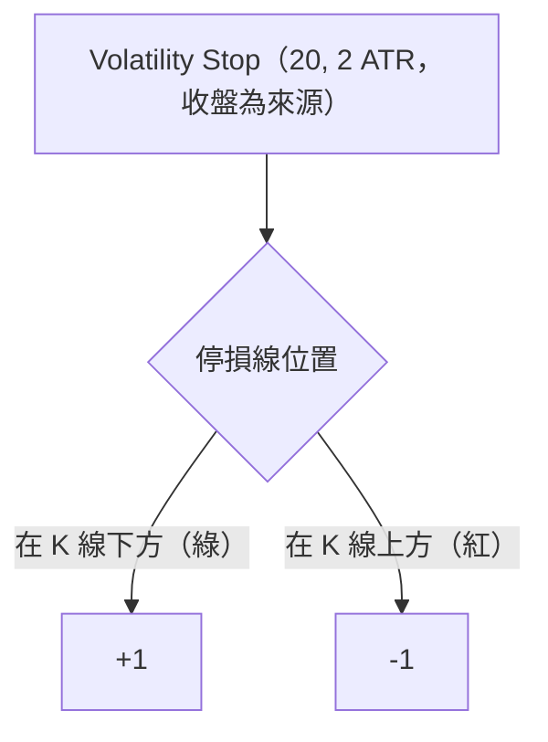
```mermaid
flowchart TD
    s["Volatility Stop（20, 2 ATR，收盤為來源）"] --> q{"停損線位置"}
    q -- "在 K 線下方（綠）" --> p["+1"]
    q -- "在 K 線上方（紅）" --> n["-1"]
```

**設計決策**
- 和 PSAR 一樣只看位置。這條線也被[交易計畫](06-trade-plan.md)拿來當結構停損和 WAIT 觸發價。
- tvscreener 沒有這個指標，實作依 TradingView 公式撰寫，用合成行情測試方向。

---

## A-11 MA 20 / 50 簡單移動平均

`ma_20_50` · Choice · ma · 1.0（**BTC / ETH 0.5**）

## A-12 EMA 20 / 50 指數移動平均

`ema_20_50` · Choice · ma · 1.0（**BTC / ETH 0.5**）

兩者同一個規則 `ma_align`，只差 `params.kind = "sma" / "ema"`。

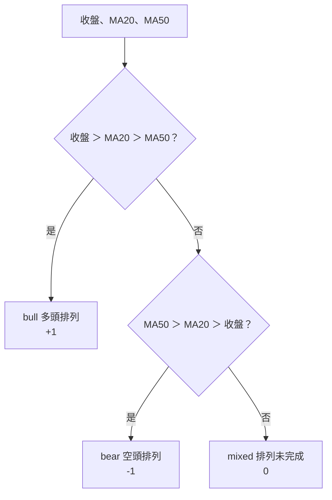
```mermaid
flowchart TD
    s["收盤、MA20、MA50"] --> q1{"收盤 ＞ MA20 ＞ MA50？"}
    q1 -- "是" --> b["bull 多頭排列<br/>+1"]
    q1 -- "否" --> q2{"MA50 ＞ MA20 ＞ 收盤？"}
    q2 -- "是" --> br["bear 空頭排列<br/>-1"]
    q2 -- "否" --> m["mixed 排列未完成<br/>0"]
```

**設計決策**
- **要求三者完整排列**：只有 MA20 ＞ MA50 但價格跌破 MA20，代表多頭排列正在被挑戰，給 0。
- 型別是 Choice，因為 A-14 需要知道兩者各自的狀態。
- 同時保留 SMA 和 EMA 兩項，是為了對應 check.html；兩者高度相關，所以 BTC / ETH 校準把兩者和 A-14 都減半。

---

## A-13 Donchian Channels 唐奇安通道

`donchian` · Score · channel · 1.0

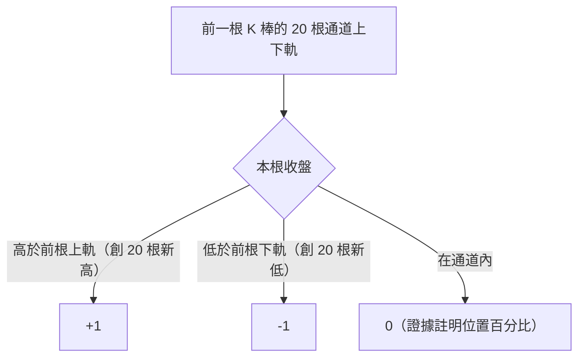
```mermaid
flowchart TD
    s["前一根 K 棒的 20 根通道上下軌"] --> q{"本根收盤"}
    q -- "高於前根上軌（創 20 根新高）" --> p["+1"]
    q -- "低於前根下軌（創 20 根新低）" --> n["-1"]
    q -- "在通道內" --> z["0（證據註明位置百分比）"]
```

**設計決策**
- **用前一根的通道**：本根的上軌已經包含本根最高價，收盤永遠不可能「高於」它。用前一根才是真正的「突破前 20 根高點」。
- 只看收盤，不看影線：這是海龜交易法的突破定義。

---

## A-14 ↳ MA × EMA 共振

`ma_x_ema` · Score · ma · 1.0（**BTC / ETH 0.5**）· **組合項**

通用規則 `agree`：讀兩個節點的分數。

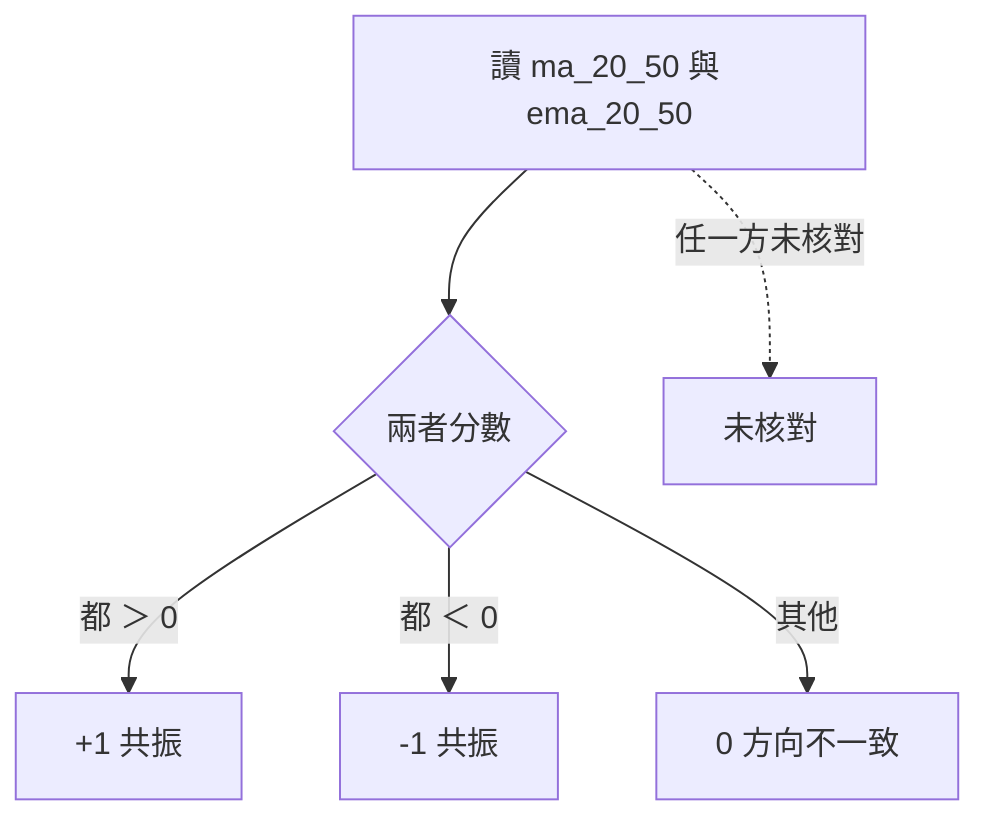
```mermaid
flowchart TD
    s["讀 ma_20_50 與 ema_20_50"] --> q{"兩者分數"}
    q -- "都 ＞ 0" --> p["+1 共振"]
    q -- "都 ＜ 0" --> n["-1 共振"]
    q -- "其他" --> z["0 方向不一致"]
    s -. "任一方未核對" .-> u["未核對"]
```

**設計決策**
- `agree` 是通用規則，`params = { a, b, score }`，新增其他「兩項共振」只需要改設定檔。

---

## A-15 Zig Zag 折線

`zigzag` · Choice · structure · 1.0

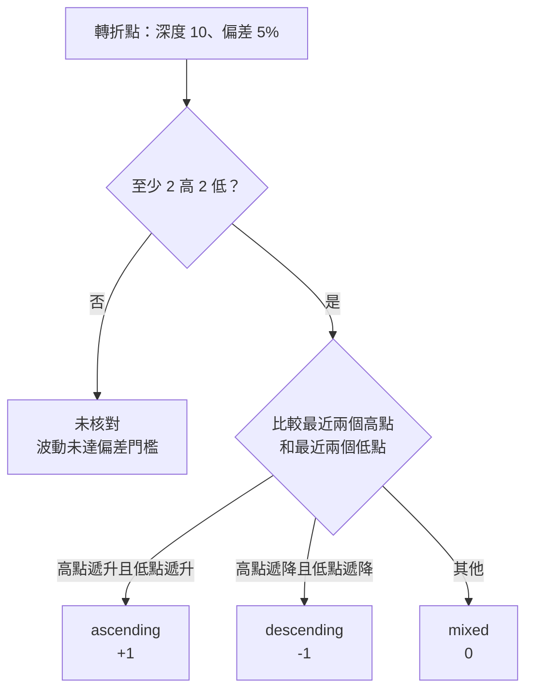
```mermaid
flowchart TD
    s["轉折點：深度 10、偏差 5%"] --> c{"至少 2 高 2 低？"}
    c -- "否" --> u["未核對<br/>波動未達偏差門檻"]
    c -- "是" --> q{"比較最近兩個高點<br/>和最近兩個低點"}
    q -- "高點遞升且低點遞升" --> p["ascending<br/>+1"]
    q -- "高點遞降且低點遞降" --> n["descending<br/>-1"]
    q -- "其他" --> m["mixed<br/>0"]
```

**設計決策**
- **高低點都要同向**才算趨勢結構（道氏理論的 HH + HL）。只有一邊成立視為整理。
- **轉折點不足時回傳未核對，而不是 0**：1h 上 5% 的偏差很少形成擺盪，這時「沒有結構」是因為參數不適合這個級別，不是市場中性。這正是「我不知道」和「中性」的區分。
- **已知限制**：最後一個轉折點會隨新 K 棒改變（重繪），兩點比較也很粗糙。這是設定檔裡附上 [Jev 範例](08-config-and-calibration.md#jev-節點)的原因。

**參數**：`[indicators] zigzag = { deviation = 5.0, depth = 10 }`

---

## A-16 Supertrend 超級趨勢

`supertrend` · Score · trend · 1.0（B-1 `supertrend_b` 同規則）

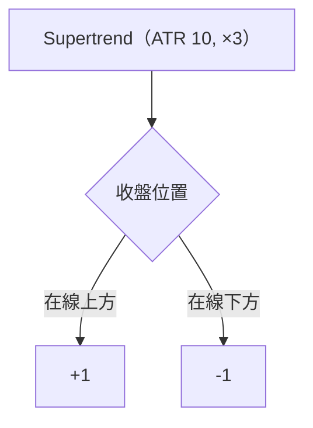
```mermaid
flowchart TD
    s["Supertrend（ATR 10, ×3）"] --> q{"收盤位置"}
    q -- "在線上方" --> p["+1"]
    q -- "在線下方" --> n["-1"]
```

**設計決策**
- **只看位置、不看顏色**：顏色（方向）在翻轉當根和位置可能不一致；位置是當下最直接的事實。
- 這條線也是[交易計畫](06-trade-plan.md)的結構停損候選。

---

## A-17 Linear Regression 線性迴歸

`linreg` · Score · trend · 1.0

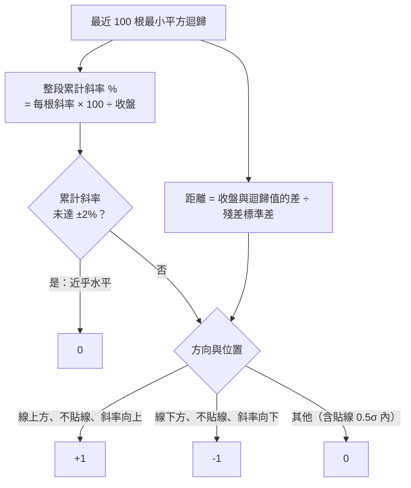
```mermaid
flowchart TD
    s["最近 100 根最小平方迴歸"] --> sl["整段累計斜率 %<br/>= 每根斜率 × 100 ÷ 收盤"]
    s --> nr["距離 = 收盤與迴歸值的差 ÷ 殘差標準差"]
    sl --> f{"累計斜率<br/>未達 ±2%？"}
    f -- "是：近乎水平" --> z1["0"]
    f -- "否" --> q{"方向與位置"}
    nr --> q
    q -- "線上方、不貼線、斜率向上" --> p["+1"]
    q -- "線下方、不貼線、斜率向下" --> n["-1"]
    q -- "其他（含貼線 0.5σ 內）" --> z2["0"]
```

**設計決策**
- **斜率換算成整段累計百分比**：原始斜率（每根多少美元）無法跨幣種比較。
- **「貼線」用殘差標準差衡量**：價格在迴歸線 0.5σ 內代表還在通道中心，沒有方向優勢。
- 要求「位置」和「斜率」同向：價格在上升趨勢線下方，可能是趨勢正在轉弱。

**參數**：`flat_pct = 2.0`、`near_dev = 0.5`；長度 `[indicators] linreg = { length = 100 }`

---

## A-18 ↳ SAR × Linear Reg 雙確認

`sar_x_linreg` · Score · trend · 1.0 · **組合項**

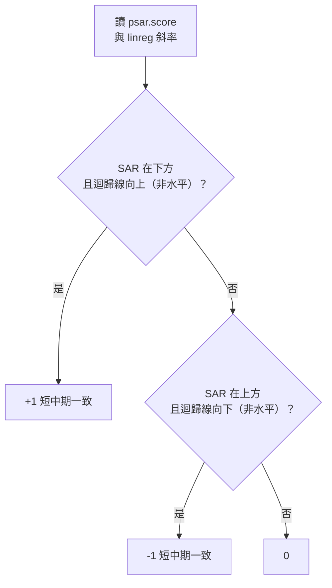
```mermaid
flowchart TD
    s["讀 psar.score<br/>與 linreg 斜率"] --> q1{"SAR 在下方<br/>且迴歸線向上（非水平）？"}
    q1 -- "是" --> p["+1 短中期一致"]
    q1 -- "否" --> q2{"SAR 在上方<br/>且迴歸線向下（非水平）？"}
    q2 -- "是" --> n["-1 短中期一致"]
    q2 -- "否" --> z["0"]
```

**設計決策**
- **讀迴歸線的斜率，不讀 A-17 的分數**：A-17 還要求價格不貼線，但這裡只問「短期（SAR）和中期（100 根趨勢）方向是否一致」，所以只取斜率。
- 迴歸線走平時一律 0。

---

## A-19 VWMA 量加權移動平均

`vwma` · Score · volume · 1.0（B-14 `vwma_b` 同規則）

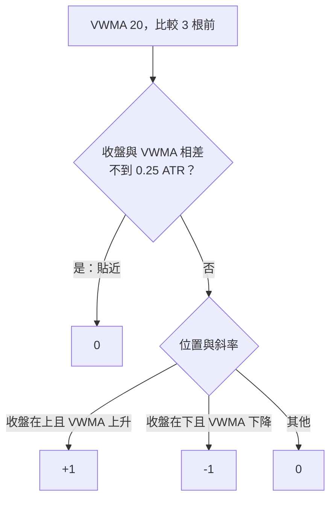
```mermaid
flowchart TD
    s["VWMA 20，比較 3 根前"] --> near{"收盤與 VWMA 相差<br/>不到 0.25 ATR？"}
    near -- "是：貼近" --> z1["0"]
    near -- "否" --> q{"位置與斜率"}
    q -- "收盤在上且 VWMA 上升" --> p["+1"]
    q -- "收盤在下且 VWMA 下降" --> n["-1"]
    q -- "其他" --> z2["0"]
```

**設計決策**
- **貼近區用 ATR 定義**：價格在均線附近來回時，上下只是雜訊。
- 群組是 volume 而不是 ma：VWMA 以成交量加權，代表「多數成交發生在什麼價位」，不受趨勢 gate 影響。

**參數**：`slope_bars = 3`、`near_atr = 0.25`
