# 05 Section B 逐項決策與 Gate（`o/{symbol}.html`，17 項）

> 格式同 [04 Section A](04-nodes-section-a.md)。Section B 偏重動能、波動和量能；最後兩節是不投票的 gate 節點和停用節點。

[← Section A](04-nodes-section-a.md)　｜　[回目錄](README.md)

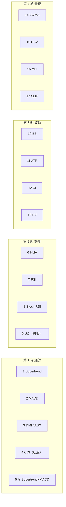
```mermaid
flowchart LR
    subgraph g1["第 1 組 趨勢"]
        direction TB
        b1["1 Supertrend"] ~~~ b2["2 MACD"] ~~~ b3["3 DMI / ADX"] ~~~ b4["4 CCI（初版）"] ~~~ b5["5 ↳ Supertrend×MACD"]
    end
    subgraph g2["第 2 組 動能"]
        direction TB
        b6["6 HMA"] ~~~ b7["7 RSI"] ~~~ b8["8 Stoch RSI"] ~~~ b9["9 UO（初版）"]
    end
    subgraph g3["第 3 組 波動"]
        direction TB
        b10["10 BB"] ~~~ b11["11 ATR"] ~~~ b12["12 CI"] ~~~ b13["13 HV"]
    end
    subgraph g4["第 4 組 量能"]
        direction TB
        b14["14 VWMA"] ~~~ b15["15 OBV"] ~~~ b16["16 MFI"] ~~~ b17["17 CMF"]
    end
```

o/ 頁面已經把 Aroon 換成 CCI、ROC 換成 Ultimate Oscillator（依 crypto-watch 回測結果），但 check.html 仍是舊版。所以 CCI 和 UO 的規則 **CHECK.md 還沒有定義，目前是初版，需要審核**。

---

## B-1 Supertrend

`supertrend_b` · Score · trend · 1.0

規則同 [A-16](04-nodes-section-a.md#a-16-supertrend-超級趨勢)。和 A-16 永遠給同樣的分數，等於 Supertrend 投了兩票（見 [03 已知取捨](03-decision-model.md#已知取捨)）。

---

## B-2 MACD

`macd` · Score · momentum · 1.0

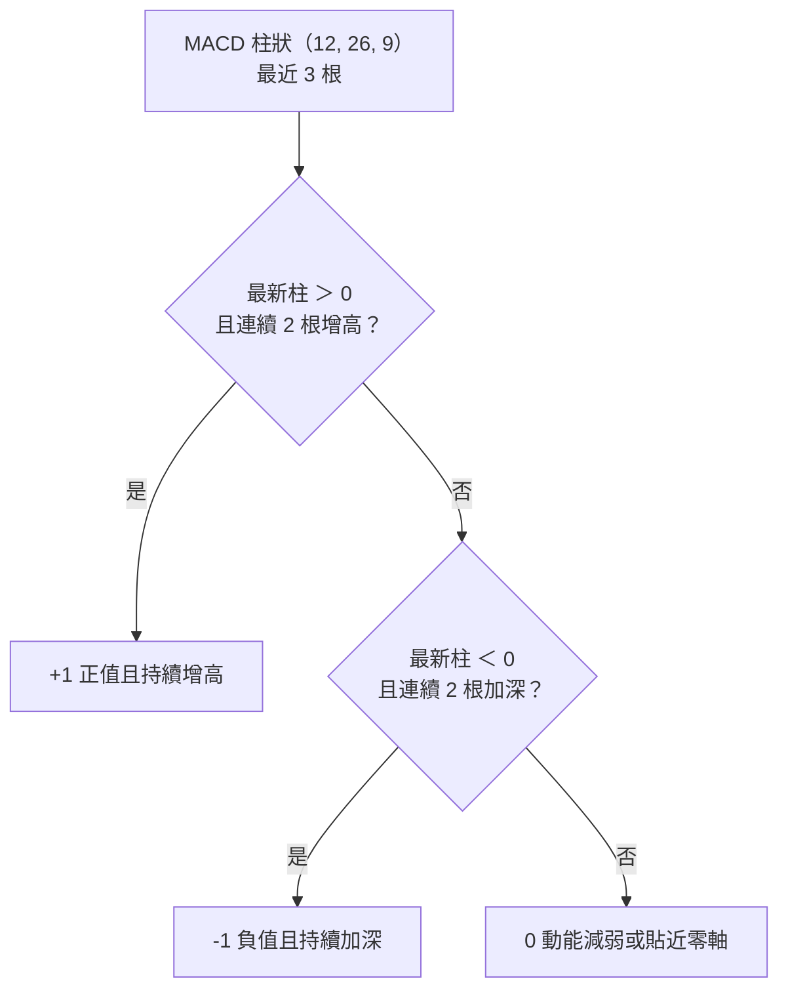
```mermaid
flowchart TD
    s["MACD 柱狀（12, 26, 9）<br/>最近 3 根"] --> q1{"最新柱 ＞ 0<br/>且連續 2 根增高？"}
    q1 -- "是" --> p["+1 正值且持續增高"]
    q1 -- "否" --> q2{"最新柱 ＜ 0<br/>且連續 2 根加深？"}
    q2 -- "是" --> n["-1 負值且持續加深"]
    q2 -- "否" --> z["0 動能減弱或貼近零軸"]
```

**設計決策**
- **看柱狀，不看 MACD 線交叉**：柱狀就是 MACD 線和訊號線的差，它的變化比交叉提早反映動能轉折。
- **要求「正值且增高」**：柱為正但在縮小，代表多頭動能在減弱，這正是實例中 BTC 4h 給 0 的原因（345 → 290 → 252）。

**參數**：`rising_bars = 2`

---

## B-3 DMI / ADX 趨向指標

`dmi` · Score · trend · 1.0（**BTC 0.5**；**ETH 多方給 0**）

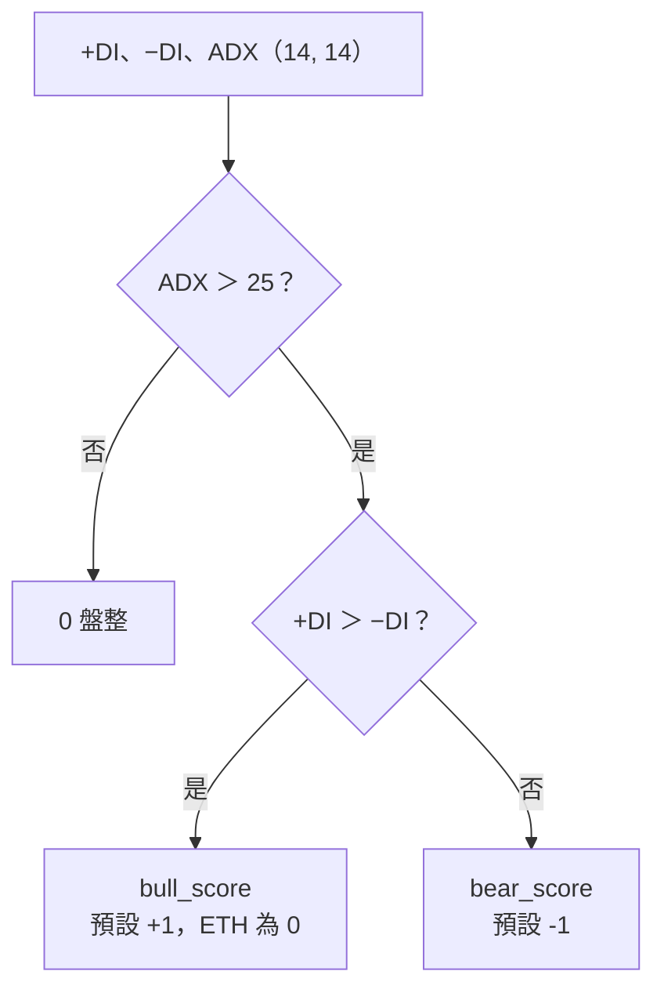
```mermaid
flowchart TD
    s["+DI、−DI、ADX（14, 14）"] --> q1{"ADX ＞ 25？"}
    q1 -- "否" --> z["0 盤整"]
    q1 -- "是" --> q2{"+DI ＞ −DI？"}
    q2 -- "是" --> p["bull_score<br/>預設 +1，ETH 為 0"]
    q2 -- "否" --> n["bear_score<br/>預設 -1"]
```

**設計決策**
- **ADX 門檻寫在節點內，也寫在 gate 裡**：節點回答「現在誰佔優」；gate 回答「趨勢類指標該不該被信任」。兩者用途不同，所以都保留。
- **ETH 的 `bull_score = 0`**：回測顯示 ETH「ADX 確認的上升趨勢」之後 24 小時反而偏跌（-9.5pp），所以關掉多方那一邊。這是用 `*_score` 參數讓單邊失效的例子。

**參數**：`adx_min = 25`、`bull_score`、`bear_score`

---

## B-4 CCI 順勢指標（初版）

`cci` · Score · momentum · 1.0（**ETH 上方給 -1**）

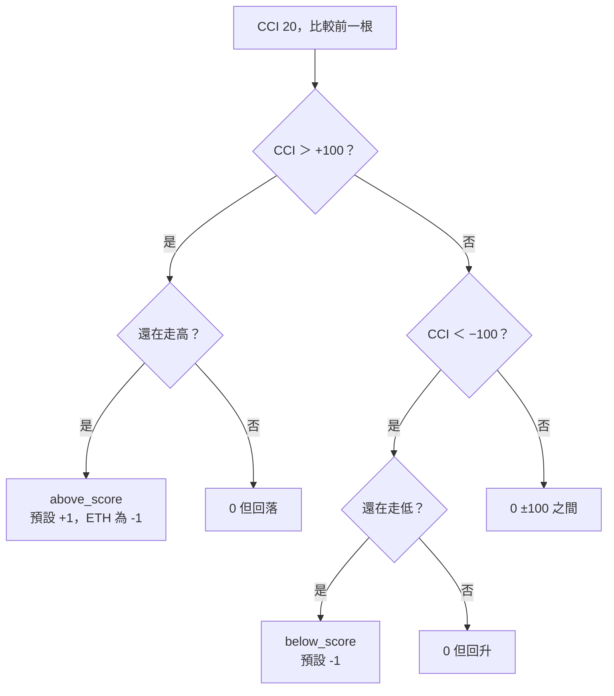
```mermaid
flowchart TD
    s["CCI 20，比較前一根"] --> q1{"CCI ＞ +100？"}
    q1 -- "是" --> r1{"還在走高？"}
    r1 -- "是" --> p["above_score<br/>預設 +1，ETH 為 -1"]
    r1 -- "否" --> z1["0 但回落"]
    q1 -- "否" --> q2{"CCI ＜ −100？"}
    q2 -- "是" --> r2{"還在走低？"}
    r2 -- "是" --> n["below_score<br/>預設 -1"]
    r2 -- "否" --> z2["0 但回升"]
    q2 -- "否" --> z3["0 ±100 之間"]
```

**設計決策**
- **預設用順勢解讀**（Lambert 原始用法：突破 +100 代表新趨勢開始），並要求還在延伸，否則給 0。
- **ETH 反過來**：回測顯示 ETH 的 CCI > 100 之後偏跌（+6.7pp），對 ETH 是均值回歸指標。這說明同一個指標對不同幣種可能要反向解讀，所以方向做成參數而不是寫死。
- **待審核**：CHECK.md 尚未定義。

**參數**：`level = 100`、`above_score`、`below_score`

---

## B-5 ↳ Supertrend × MACD 趨勢 × 動能

`supertrend_x_macd` · Score · trend · 1.0 · **組合項**

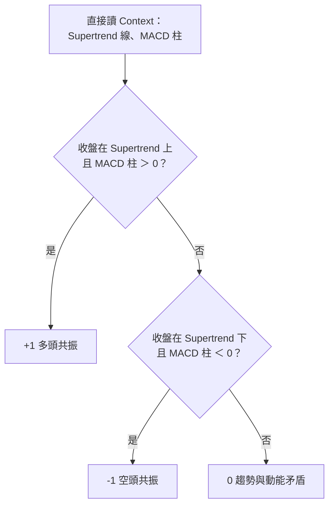
```mermaid
flowchart TD
    s["直接讀 Context：<br/>Supertrend 線、MACD 柱"] --> q1{"收盤在 Supertrend 上<br/>且 MACD 柱 ＞ 0？"}
    q1 -- "是" --> p["+1 多頭共振"]
    q1 -- "否" --> q2{"收盤在 Supertrend 下<br/>且 MACD 柱 ＜ 0？"}
    q2 -- "是" --> n["-1 空頭共振"]
    q2 -- "否" --> z["0 趨勢與動能矛盾"]
```

**設計決策**
- **不讀 B-2 的答案**：B-2 要求柱狀「持續增高」，但 check.html 這一格只要求「正值柱」。如果讀 B-2 的分數，會把兩個不同的條件混在一起。所以直接讀指標原值。
- 群組歸在 trend（受 gate 影響），因為它的主體是 Supertrend。

---

## B-6 Hull MA 赫爾均線

`hma` · Score · ma · 1.0

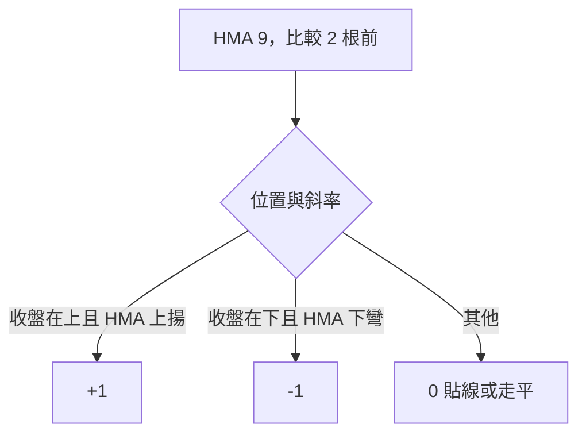
```mermaid
flowchart TD
    s["HMA 9，比較 2 根前"] --> q{"位置與斜率"}
    q -- "收盤在上且 HMA 上揚" --> p["+1"]
    q -- "收盤在下且 HMA 下彎" --> n["-1"]
    q -- "其他" --> z["0 貼線或走平"]
```

**設計決策**
- HMA 反應快、延遲低，是 Section B 裡唯一的均線，所以歸在 ma 群組、受 gate 影響。
- 位置和斜率都要同向，和 VWMA、線性迴歸的規則同一個模式。

**參數**：`slope_bars = 2`

---

## B-7 RSI 相對強弱

`rsi` · Score · momentum · 1.0（**ETH 1.5**；BTC / ETH 的超買超賣分數另行校準）

這是規則最細的一項：中間區間看位置，極端區間看**背離**。

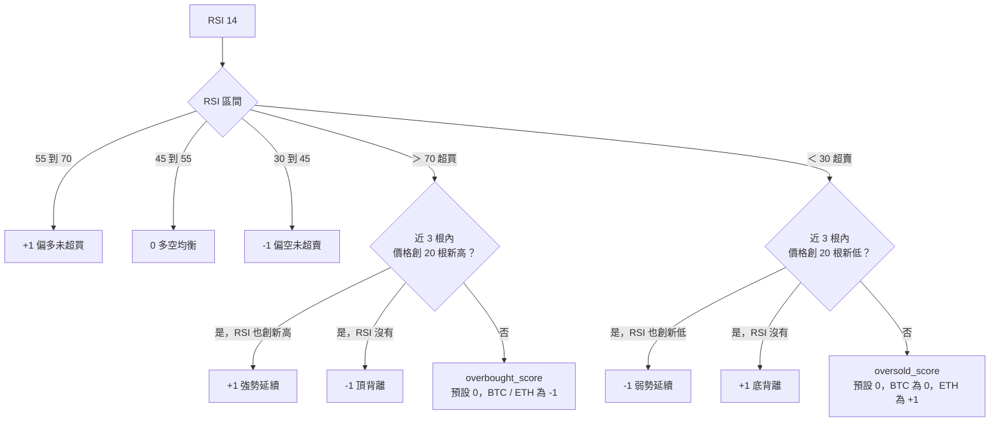
```mermaid
flowchart TD
    s["RSI 14"] --> q{"RSI 區間"}
    q -- "55 到 70" --> p1["+1 偏多未超買"]
    q -- "45 到 55" --> z1["0 多空均衡"]
    q -- "30 到 45" --> n1["-1 偏空未超賣"]
    q -- "＞ 70 超買" --> ob{"近 3 根內<br/>價格創 20 根新高？"}
    ob -- "是，RSI 也創新高" --> p2["+1 強勢延續"]
    ob -- "是，RSI 沒有" --> n2["-1 頂背離"]
    ob -- "否" --> obs["overbought_score<br/>預設 0，BTC / ETH 為 -1"]
    q -- "＜ 30 超賣" --> os{"近 3 根內<br/>價格創 20 根新低？"}
    os -- "是，RSI 也創新低" --> n3["-1 弱勢延續"]
    os -- "是，RSI 沒有" --> p3["+1 底背離"]
    os -- "否" --> oss["oversold_score<br/>預設 0，BTC 為 0，ETH 為 +1"]
```

**設計決策**
- **超買不等於賣出**。強勢行情中 RSI 可以在 70 以上停留很久。所以超買時先問「價格和 RSI 是否同步創高」：同步 = 強勢延續，不同步 = 背離。
- **沒有新高可以比對時，交給校準決定**：預設 0（不表態），BTC / ETH 的回測都顯示超買之後偏跌，所以設為 -1。
- **超賣端兩個幣種不同**：BTC 的超賣反彈沒有 edge（`oversold_score = 0`），ETH 有（+6.5pp → `+1`）。
- 背離判斷只用最近 3 根對 20 根的新高 / 新低，是刻意簡化的版本；更細的背離判斷適合改問 Jev（`rsi.rsi_prev` 已在 state 中）。

**參數**：`overbought = 70`、`oversold = 30`、`neutral_band = [45, 55]`、`divergence_lookback = 20`、`overbought_score`、`oversold_score`

---

## B-8 Stochastic RSI 隨機相對強弱

`stoch_rsi` · Score · momentum · 1.0

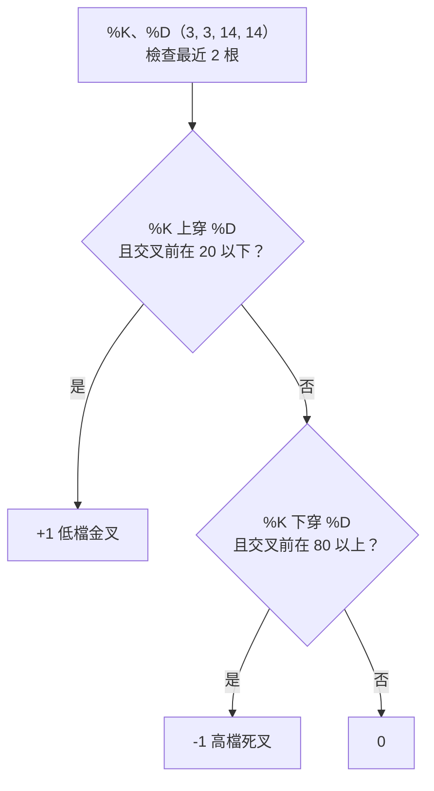
```mermaid
flowchart TD
    s["%K、%D（3, 3, 14, 14）<br/>檢查最近 2 根"] --> q1{"%K 上穿 %D<br/>且交叉前在 20 以下？"}
    q1 -- "是" --> p["+1 低檔金叉"]
    q1 -- "否" --> q2{"%K 下穿 %D<br/>且交叉前在 80 以上？"}
    q2 -- "是" --> n["-1 高檔死叉"]
    q2 -- "否" --> z["0"]
```

**設計決策**
- **只有極端區的交叉才算**：Stoch RSI 在中間區間交叉太頻繁，幾乎是雜訊。
- 這是事件型訊號，大部分時間給 0；不必擔心，這正代表「目前沒有這個訊號」。

**參數**：`lookback = 2`、`low = 20`、`high = 80`

---

## B-9 Ultimate Oscillator 終極震盪（初版）

`uo` · Score · momentum · 1.0（**BTC 2.0**，超賣端關閉）

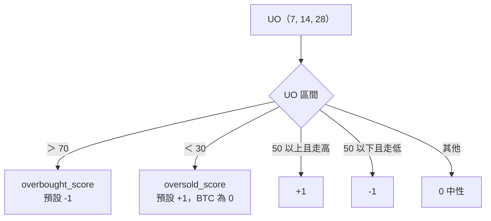
```mermaid
flowchart TD
    s["UO（7, 14, 28）"] --> q{"UO 區間"}
    q -- "＞ 70" --> ob["overbought_score<br/>預設 -1"]
    q -- "＜ 30" --> os["oversold_score<br/>預設 +1，BTC 為 0"]
    q -- "50 以上且走高" --> p["+1"]
    q -- "50 以下且走低" --> n["-1"]
    q -- "其他" --> z["0 中性"]
```

**設計決策**
- **極端區用均值回歸解讀**（和 CCI 預設相反），因為 UO 本身就是為了找超買超賣設計的。
- **BTC 權重 2.0**：回測中 UO > 70 之後 BTC 偏跌 +16.6pp，是單一最強的訊號。但 UO < 30 之後反而偏跌（-9.8pp），所以超賣端 `oversold_score = 0`。
- **副作用**：UO 中性時貢獻 0 分但佔 2 倍分母，會把 BTC 的綜合分數往 0 拉。這在 [03 的實例](03-decision-model.md#實例btc-4h2026-09-22-1600-utc-回放)可以看到。
- **待審核**：CHECK.md 尚未定義。

**參數**：`overbought = 70`、`oversold = 30`、`overbought_score`、`oversold_score`

---

## B-10 Bollinger Bands

`bb_b` · Score · channel · 1.0

規則同 [A-6](04-nodes-section-a.md#a-6-bollinger-bands-布林通道)。

---

## B-11 ATR 平均真實波幅

`atr` · Score · volatility · 1.0

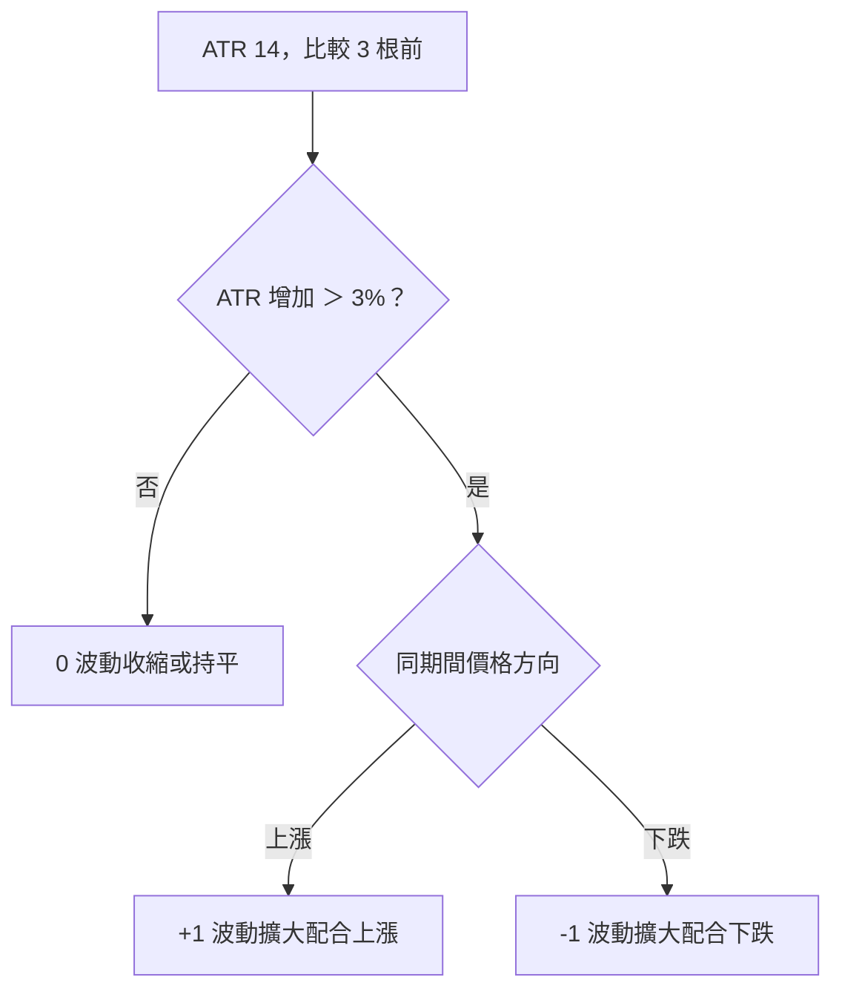
```mermaid
flowchart TD
    s["ATR 14，比較 3 根前"] --> q1{"ATR 增加 ＞ 3%？"}
    q1 -- "否" --> z["0 波動收縮或持平"]
    q1 -- "是" --> q2{"同期間價格方向"}
    q2 -- "上漲" --> p["+1 波動擴大配合上漲"]
    q2 -- "下跌" --> n["-1 波動擴大配合下跌"]
```

**設計決策**
- ATR 本身沒有方向。check.html 的判讀是「波動放大時，順著價格方向」，所以用同期間的價格變化決定正負。
- 3% 的門檻過濾掉 ATR 的自然起伏。

**參數**：`lookback = 3`、`min_change_pct = 3`

---

## B-12 Choppiness Index 波動指數

`choppiness` · Score · volatility · 1.0

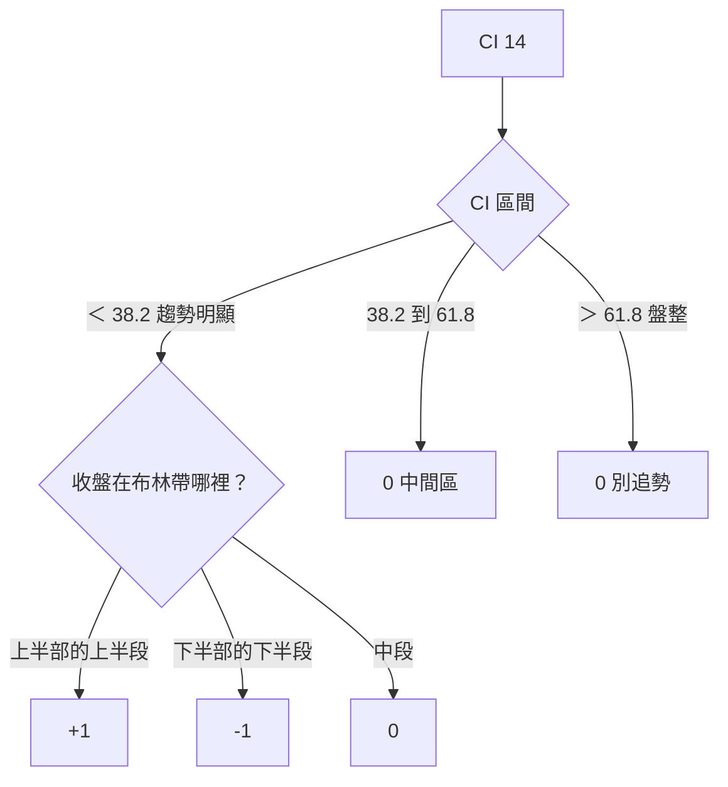
```mermaid
flowchart TD
    s["CI 14"] --> q{"CI 區間"}
    q -- "＜ 38.2 趨勢明顯" --> pos{"收盤在布林帶哪裡？"}
    pos -- "上半部的上半段" --> p["+1"]
    pos -- "下半部的下半段" --> n["-1"]
    pos -- "中段" --> z1["0"]
    q -- "38.2 到 61.8" --> z2["0 中間區"]
    q -- "＞ 61.8 盤整" --> z3["0 別追勢"]
```

**設計決策**
- CI 只說「有沒有趨勢」，不說方向。趨勢明顯時用布林帶位置補上方向。
- **這個節點投票，另一個 `choppy` gate 則調權重**。兩者都讀 CI，但回答不同的問題：前者「有趨勢且方向是？」，後者「趨勢類指標可信嗎？」。
- 38.2 / 61.8 是 CI 的慣用費氏門檻。

**參數**：`trend_below = 38.2`、`chop_above = 61.8`

---

## B-13 Historical Volatility 歷史波動率

`hv` · Score · volatility · 1.0

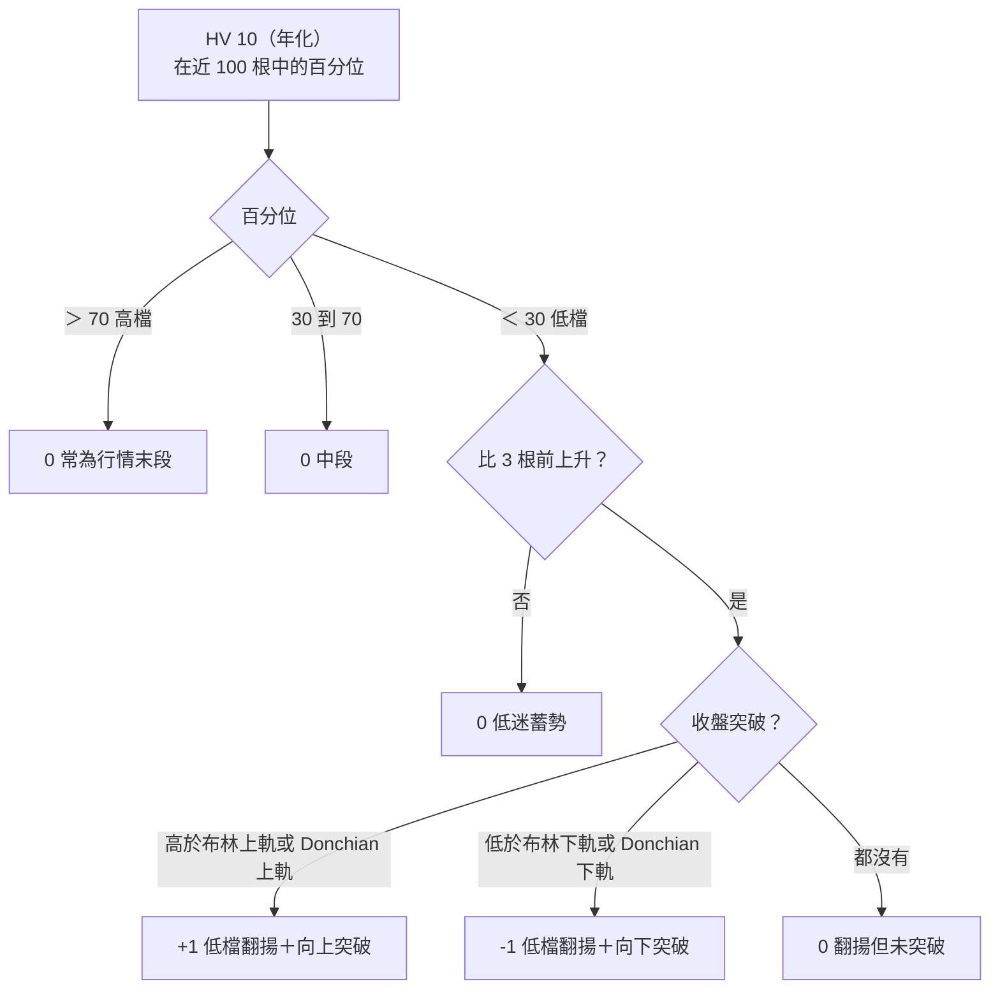
```mermaid
flowchart TD
    s["HV 10（年化）<br/>在近 100 根中的百分位"] --> q{"百分位"}
    q -- "＞ 70 高檔" --> z1["0 常為行情末段"]
    q -- "30 到 70" --> z2["0 中段"]
    q -- "＜ 30 低檔" --> r{"比 3 根前上升？"}
    r -- "否" --> z3["0 低迷蓄勢"]
    r -- "是" --> b{"收盤突破？"}
    b -- "高於布林上軌或 Donchian 上軌" --> p["+1 低檔翻揚＋向上突破"]
    b -- "低於布林下軌或 Donchian 下軌" --> n["-1 低檔翻揚＋向下突破"]
    b -- "都沒有" --> z4["0 翻揚但未突破"]
```

**設計決策**
- **用百分位而不是絕對值**：BTC 和小幣的 HV 水準差很多，百分位讓同一個門檻通用。
- **只有「低波動 → 波動開始放大 → 價格突破」才給方向**：這是波動率擴張的經典進場條件。其他狀態都只是背景資訊，給 0。
- 週線、月線的年化因子會調整（`per = 7`）。

**參數**：`window = 100`、`lookback = 3`、`low_pct = 30`、`high_pct = 70`

---

## B-14 VWMA

`vwma_b` · Score · volume · 1.0

規則同 [A-19](04-nodes-section-a.md#a-19-vwma-量加權移動平均)。

---

## B-15 On Balance Volume 能量潮

`obv` · Score · volume · 1.0

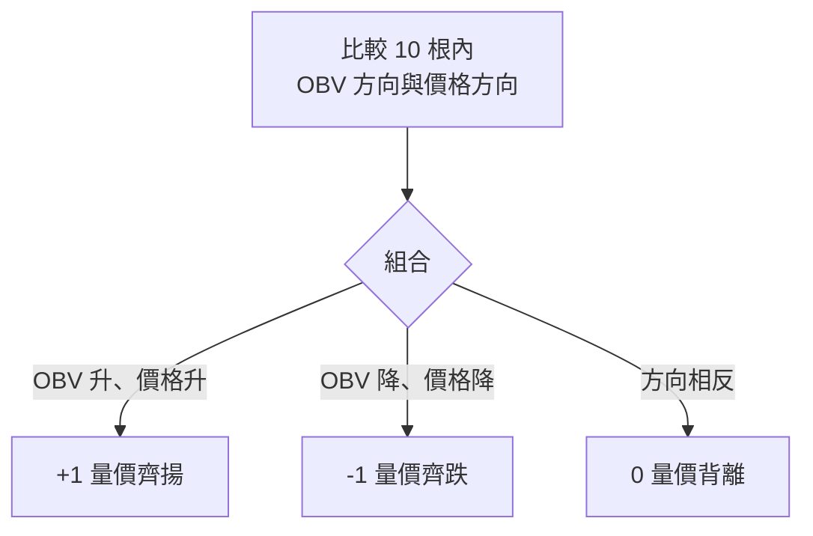
```mermaid
flowchart TD
    s["比較 10 根內<br/>OBV 方向與價格方向"] --> q{"組合"}
    q -- "OBV 升、價格升" --> p["+1 量價齊揚"]
    q -- "OBV 降、價格降" --> n["-1 量價齊跌"]
    q -- "方向相反" --> z["0 量價背離"]
```

**設計決策**
- OBV 的絕對值沒有意義，只看方向。
- **背離給 0，不給反向分數**：量價背離常被解讀成反轉前兆，但它也常持續很久。在沒有回測支持前，只把它當成「不確認目前方向」。

**參數**：`lookback = 10`

---

## B-16 MFI 資金流量指標

`mfi` · Score · volume · 1.0（**ETH 1.5**；BTC / ETH 超買給 -1）

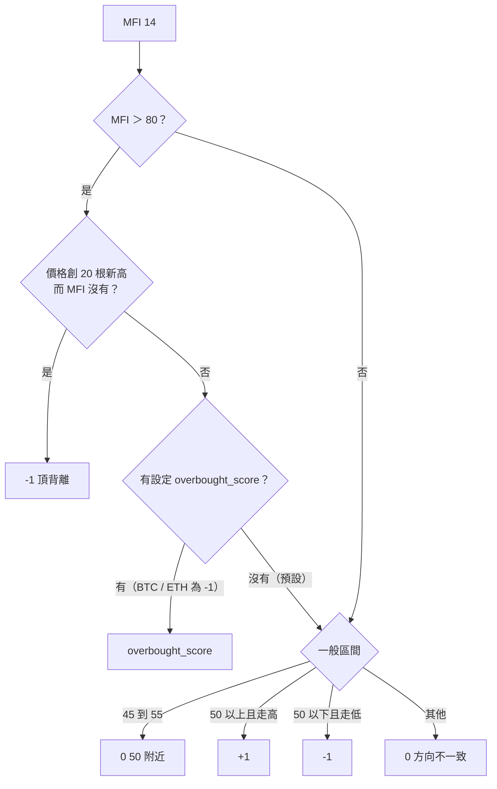
```mermaid
flowchart TD
    s["MFI 14"] --> q1{"MFI ＞ 80？"}
    q1 -- "是" --> d{"價格創 20 根新高<br/>而 MFI 沒有？"}
    d -- "是" --> n1["-1 頂背離"]
    d -- "否" --> obs{"有設定 overbought_score？"}
    obs -- "有（BTC / ETH 為 -1）" --> n2["overbought_score"]
    obs -- "沒有（預設）" --> mid
    q1 -- "否" --> mid{"一般區間"}
    mid -- "45 到 55" --> z1["0 50 附近"]
    mid -- "50 以上且走高" --> p["+1"]
    mid -- "50 以下且走低" --> n3["-1"]
    mid -- "其他" --> z2["0 方向不一致"]
```

**設計決策**
- MFI 是含成交量的 RSI，所以沿用 RSI 的「超買先看背離」邏輯。
- **預設沒有 `overbought_score`**：超買但無背離時「落到一般區間規則」（通常會給 +1）。BTC（+6.4pp）和 ETH（+13.1pp）的回測都顯示 MFI > 80 之後偏跌，所以兩者都設為 -1。
- 超賣端沒有特殊處理：回測中沒有顯著 edge。

**參數**：`overbought = 80`、`neutral_band = [45, 55]`、`divergence_lookback = 20`、`overbought_score`（選填）

---

## B-17 Chaikin Money Flow 資金流向

`cmf` · Score · volume · 1.0

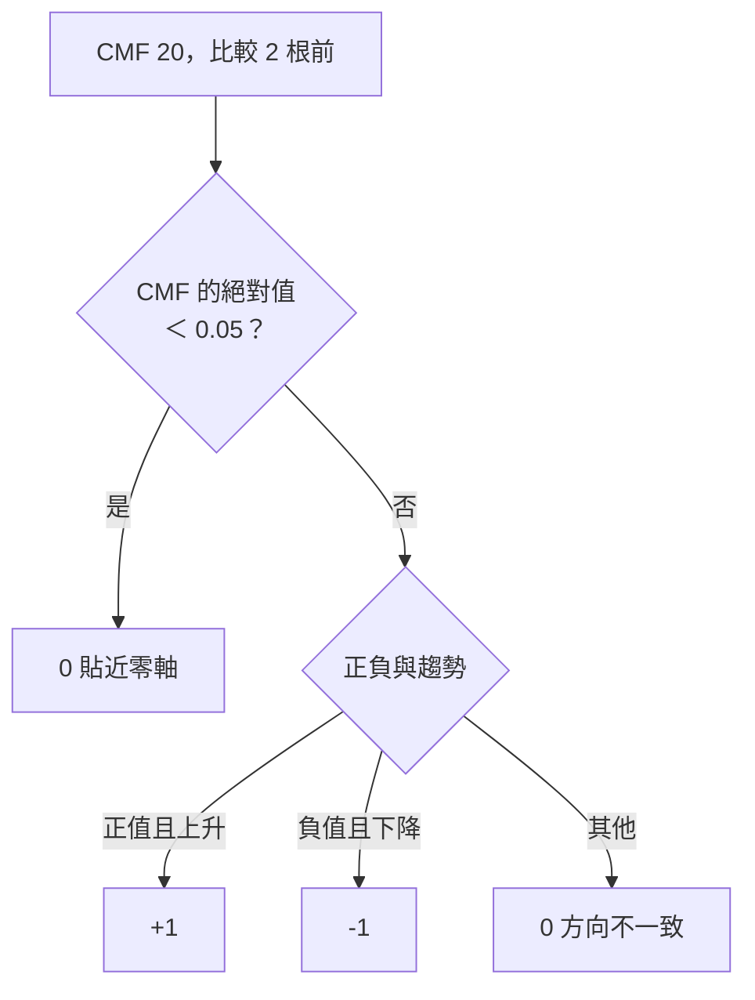
```mermaid
flowchart TD
    s["CMF 20，比較 2 根前"] --> q1{"CMF 的絕對值<br/>＜ 0.05？"}
    q1 -- "是" --> z1["0 貼近零軸"]
    q1 -- "否" --> q2{"正負與趨勢"}
    q2 -- "正值且上升" --> p["+1"]
    q2 -- "負值且下降" --> n["-1"]
    q2 -- "其他" --> z2["0 方向不一致"]
```

**設計決策**
- ±0.05 的零軸帶過濾掉資金流接近平衡時的雜訊。
- 和其他量能指標一樣，要求「水準」和「變化」同向。

**參數**：`slope_bars = 2`、`zero_band = 0.05`

---

## Gate 節點（Noul，不投票）

gate 節點的 `section = "gate"`，不出現在 A / B 表格，只在報告的 GATES 區塊顯示。公式和效果見 [03 的 gate 一節](03-decision-model.md#gate用-noul-調整群組權重)。

### `trend_established` 趨勢確立（ADX）

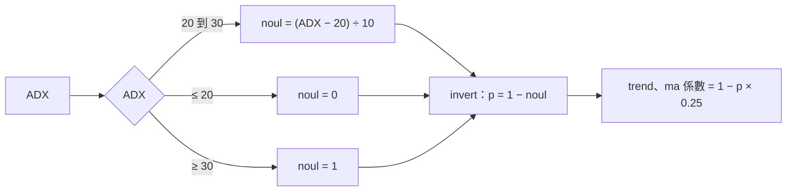
```mermaid
flowchart LR
    adx["ADX"] --> q{"ADX"}
    q -- "≤ 20" --> n0["noul = 0"]
    q -- "20 到 30" --> nx["noul = (ADX − 20) ÷ 10"]
    q -- "≥ 30" --> n1["noul = 1"]
    nx --> inv["invert：p = 1 − noul"]
    n0 --> inv
    n1 --> inv
    inv --> m["trend、ma 係數 = 1 − p × 0.25"]
```

參數：`threshold = 25`、`soft_band = 5`；profile：`invert = true`、`floor = 0.75`

### `choppy` 盤整（CI）

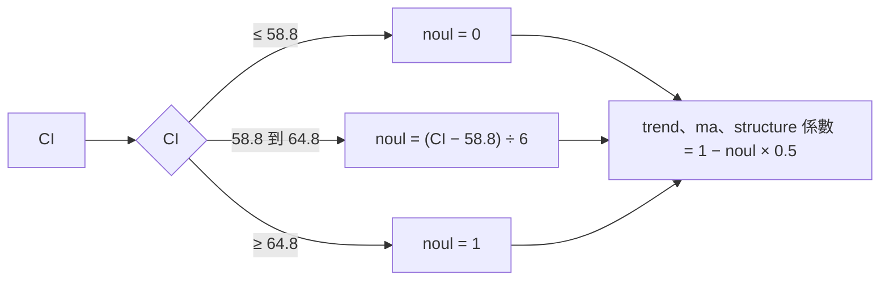
```mermaid
flowchart LR
    ci["CI"] --> q{"CI"}
    q -- "≤ 58.8" --> n0["noul = 0"]
    q -- "58.8 到 64.8" --> nx["noul = (CI − 58.8) ÷ 6"]
    q -- "≥ 64.8" --> n1["noul = 1"]
    n0 --> m["trend、ma、structure 係數 = 1 − noul × 0.5"]
    nx --> m
    n1 --> m
```

參數：`threshold = 61.8`、`soft_band = 3`；profile：`floor = 0.5`

**為什麼 gate 做成節點而不是寫在 `decide.py`**：這樣 gate 的判斷也能改問 Jev（Noul 問題），也能被 `--log` 記錄、被使用者覆寫門檻，和一般節點的待遇一致。

---

## 停用節點

停用的節點留在設定檔裡，但 `enabled = false`：完全不計算、不顯示。要恢復時把 `enabled` 設為 `true` 即可。

- Aroon 和 ROC：o/ 頁面已經換成 CCI 和 UO，只有舊版 check.html 還列著。
- MACD Cross：事件型節點，已移到 Section E，見下方和 [09](09-event-nodes.md)。

### Aroon 阿隆指標（`aroon`，trend）

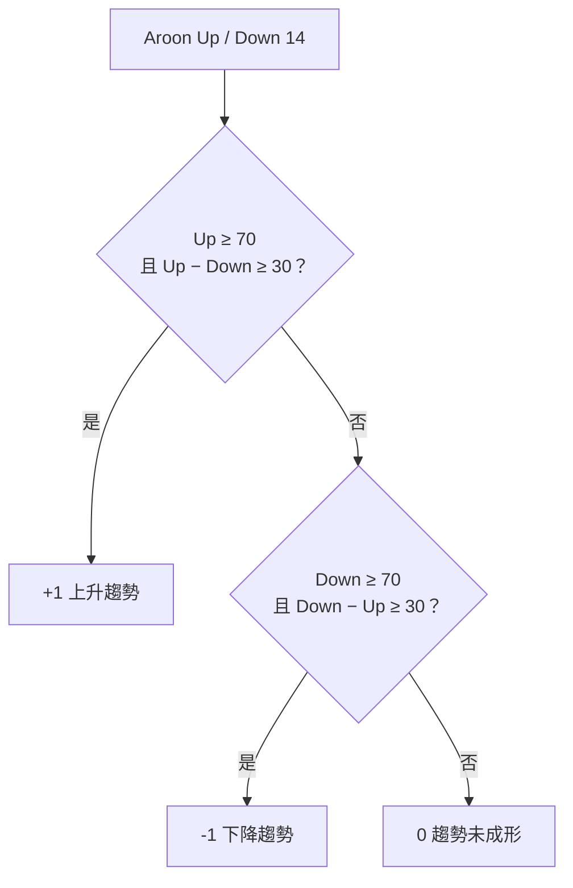
```mermaid
flowchart TD
    s["Aroon Up / Down 14"] --> q1{"Up ≥ 70<br/>且 Up − Down ≥ 30？"}
    q1 -- "是" --> p["+1 上升趨勢"]
    q1 -- "否" --> q2{"Down ≥ 70<br/>且 Down − Up ≥ 30？"}
    q2 -- "是" --> n["-1 下降趨勢"]
    q2 -- "否" --> z["0 趨勢未成形"]
```

### ROC 變動率（`roc`，momentum）

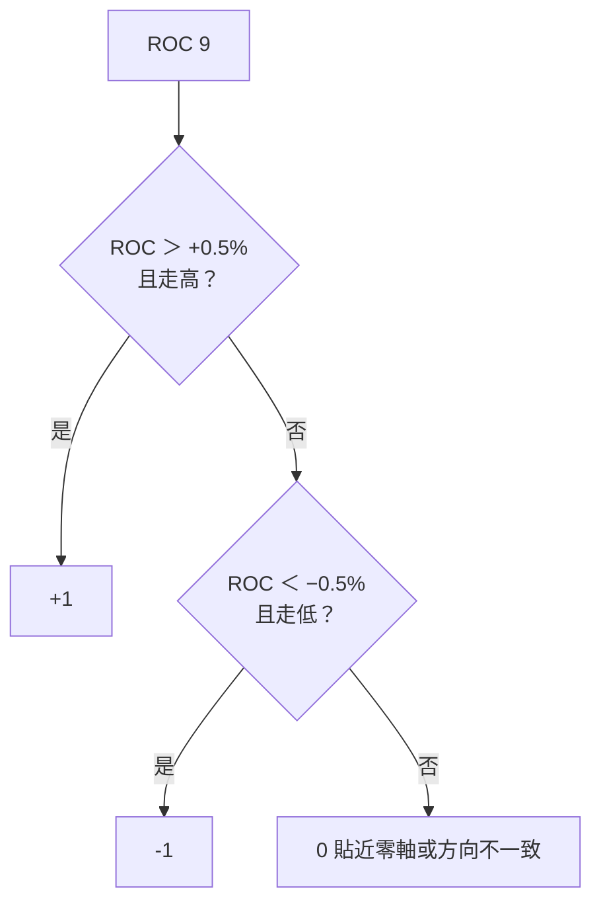
```mermaid
flowchart TD
    s["ROC 9"] --> q1{"ROC ＞ +0.5%<br/>且走高？"}
    q1 -- "是" --> p["+1"]
    q1 -- "否" --> q2{"ROC ＜ −0.5%<br/>且走低？"}
    q2 -- "是" --> n["-1"]
    q2 -- "否" --> z["0 貼近零軸或方向不一致"]
```

### MACD Cross 交叉事件（`macd_cross`，momentum）

不是 check.html 的格子。B-2 MACD 看的是柱狀圖的**狀態**（正值且增高），分不出「剛交叉」和「已經走一段」；這個節點只看**事件**。

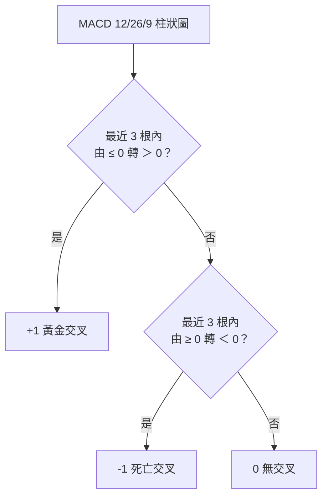
```mermaid
flowchart TD
    s["MACD 12/26/9 柱狀圖"] --> q1{"最近 3 根內<br/>由 ≤ 0 轉 ＞ 0？"}
    q1 -- "是" --> p["+1 黃金交叉"]
    q1 -- "否" --> q2{"最近 3 根內<br/>由 ≥ 0 轉 ＜ 0？"}
    q2 -- "是" --> n["-1 死亡交叉"]
    q2 -- "否" --> z["0 無交叉"]
```

證據欄會註明交叉發生在零軸上方還是下方。

**為什麼停用**：用 `replay.py --compare-node macd_cross` 在同一批 K 棒上比較導入前後，報酬看 24 小時後：

| 幣種 · 級別 | 期間 | 沒導入：次數 / 命中 | 有導入：次數 / 命中 | 節點單獨命中 |
|---|---|---|---|---|
| BTC · 1h | 3000 根 | 566 / 51% | 539 / 50% | 54% |
| BTC · 4h | 2000 根 | 366 / 47% | 357 / 48% | 55% |
| BTC · 1d | 1000 根 | 183 / 54% | 181 / 53% | 45% |
| ETH · 1h | 3000 根 | 448 / 52% | 426 / 52% | 48% |
| ETH · 4h | 2000 根 | 338 / 45% | 328 / 46% | 50% |
| ETH · 1d | 1000 根 | 208 / 51% | 198 / 52% | 46% |

- 導入前後的命中率差距都在 ±1 個百分點內，屬於雜訊。
- 節點單獨看：BTC 1h / 4h 有 54%–55%，前後半都在 50% 以上；ETH 和日線則在 50% 以下，日線甚至偏反向。沒有一致的預測力。
- 導入後 BUY/SELL 次數變少，主要是**稀釋**：這個節點大多數時間是 0，多一個 0 分的節點會把綜合分數往 0 拉。

節點永遠判斷「正在分析的那個級別」的交叉：`--tf 4h` 只看 4h 的 MACD，不會混入其他級別。設定檔只能依幣種分層、不能依級別分開，所以在 `~/.tv-ta/config/symbols/btc.toml` 寫 `[nodes.macd_cross] enabled = true`，會讓 BTC 的**所有**級別都開啟，包括回放表現偏弱的日線。

