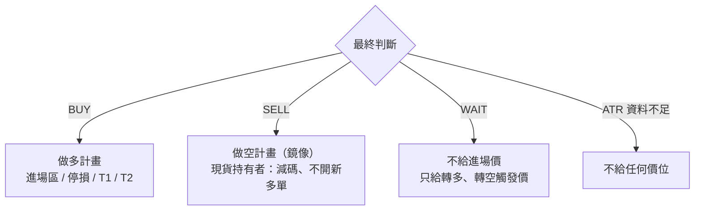
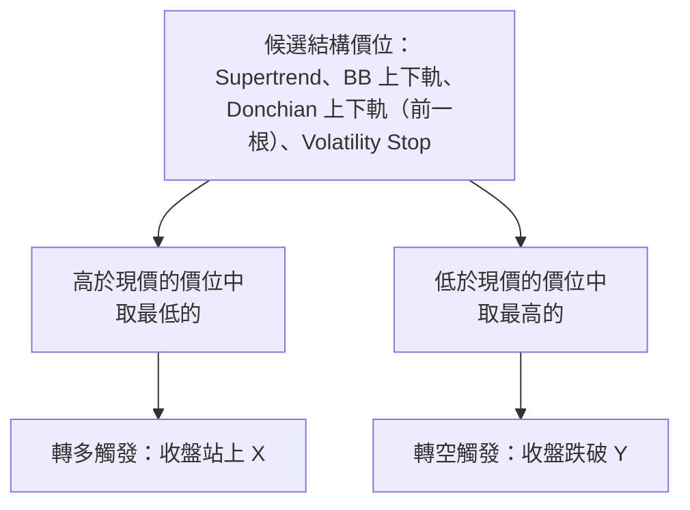
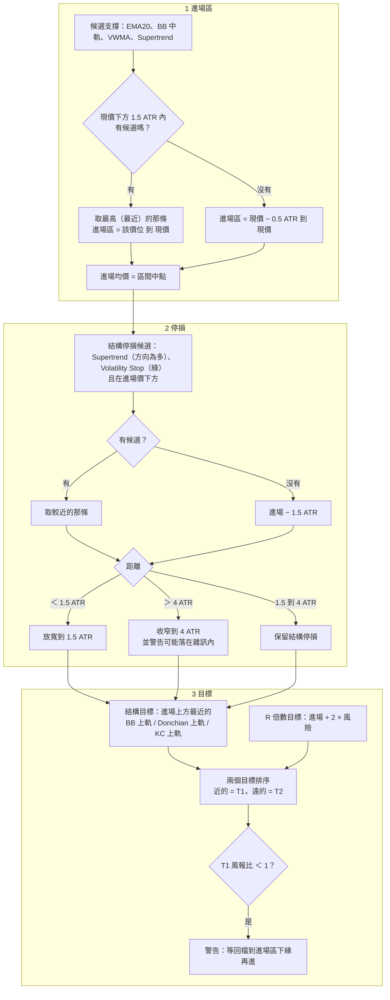

# 06 交易計畫

> 結論決定「要不要動」，交易計畫決定「在哪裡動」。價位全部取自圖上已經畫出來的線（均線、通道、Supertrend、Volatility Stop），再用 ATR 限制範圍。程式碼在 `scripts/decide.py` 的 `trade_plan()`。

[← 回目錄](README.md)

## 依結論分流

這是 tv-ta 版本的[信心度門檻路由](02-typesafe-patterns.md#信心度門檻路由confidence-gated-routing)：給出進場價和停損是**高風險動作**，只在結論明確時才做；結論不明確時，改成告訴使用者「價格到哪裡再來看」，把確認交給市場。

## WAIT：觸發價

**為什麼只用這幾條線**：它們被突破時，會同時翻轉好幾個檢核項（例如站上 BB 上軌會影響 A-6、B-10，常伴隨 B-12、B-13 的變化）。EMA20、VWMA 這類均線被穿越時只會改變一兩項，不足以把 WAIT 推成 BUY，所以不當觸發價。

## BUY：進場、停損、目標

SELL 是完全的鏡像，下面以 BUY 說明。

### 設計決策

| 決策 | 理由 |
|---|---|
| **進場區從支撐到現價，不是單一價位** | 單一價位很容易錯過；區間讓使用者可以分批，均價取中點 |
| **支撐只找 1.5 ATR 內的** | 太遠的支撐代表要等很深的回檔，這時結論可能已經改變 |
| **優先用結構停損** | Supertrend 和 Volatility Stop 翻轉時，檢核表本身也會翻空，停在那裡等於「結論改變就出場」 |
| **停損至少 1.5 ATR** | 太近的停損會被正常波動打掉 |
| **停損最多 4 ATR，超過就收窄並警告** | 結構停損太遠時風險過大；收窄後停損可能在雜訊內，所以一定要讓使用者知道 |
| **目標同時看結構和 R 倍數** | 只看結構可能給出風報比很差的目標；只看 R 倍數會忽略圖上的壓力。兩者排序後，近的當 T1、遠的當 T2 |
| **已經在通道外時用 1R 當結構目標** | 價格已經突破所有上軌時沒有結構壓力可參考 |
| **SELL 時提示現貨持有者** | 大多數使用者不做空；SELL 對他們的意義是「減碼、不開新多單」 |

### 參數（`profile.toml [plan]`）

| 參數 | 預設 | 作用 |
|---|---|---|
| `entry_support_atr` | 1.5 | 找進場支撐的最大距離 |
| `stop_atr_min` | 1.5 | 停損最小距離 |
| `stop_atr_max` | 4.0 | 停損最大距離 |
| `target_rr` | 2.0 | T2 的 R 倍數 |

## 刻意不做的事

- **不給部位大小**：部位取決於使用者的資金和風險承受度，技術面無法回答。
- **不在 WAIT 時給「預掛單」價格**：WAIT 代表還沒有方向，預掛任何一邊都是在猜。
- **不做追蹤停損**：tv-ta 是單次快照，沒有持倉狀態。
