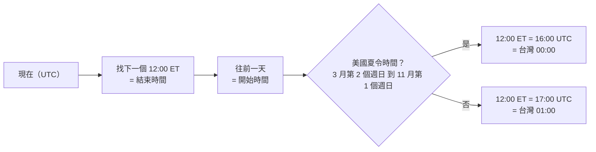
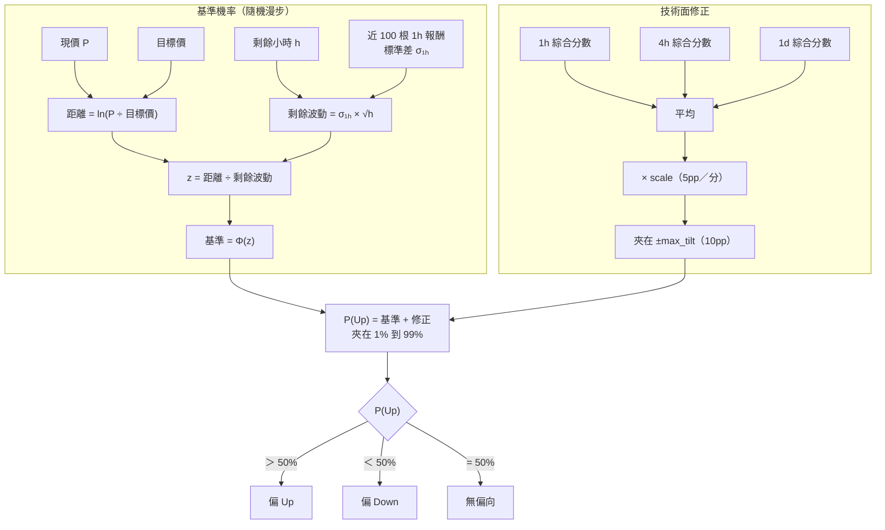
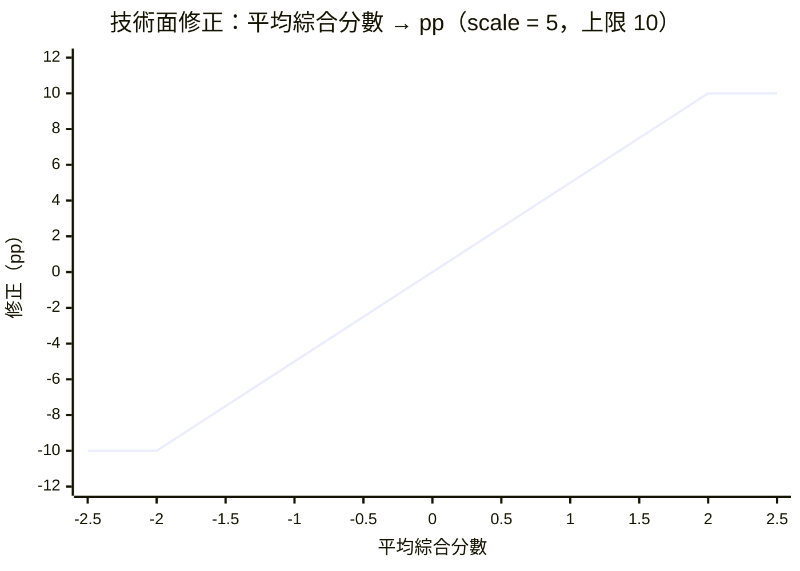

# 07 一日漲跌題

> 回答 Polymarket、幣安錢包的「{SYM} Up or Down on {日期}」。P(Up) = 由價格距離與剩餘時間決定的**基準機率** + 由多級別檢核分數決定的**技術面修正**。程式碼在 `scripts/updown.py`。

[← 回目錄](README.md)

## 題目規則與時間換算

「Up or Down on 9/23」比較兩個 Binance 1 分鐘 K 棒的收盤價：

- **目標價**：9/22 12:00 ET（開始時間）
- **結算價**：9/23 12:00 ET（結束時間）

結算價高於目標價就是 Up。



**設計決策**
- **不需要使用者給日期**：程式自動挑下一個要結算的題目。使用者問「明日漲跌」時，日期容易因時區搞錯。
- **顯示台灣時間**（`display_utc_offset = 8`）：幣安頁面顯示的是使用者當地時間，題目也要用同樣的時間稱呼，否則使用者找不到對應的題目。
- **請使用者對照「需超越的價格」**：程式抓的目標價應該和頁面上的一致；不一致代表時間換算或資料源有問題。

## P(Up) 的組成



### 基準機率

假設對數價格是沒有漂移的隨機漫步，從現在到結算還有 h 小時，每小時波動 σ₁ₕ：

```
P(結算價 > 目標價) = Φ( ln(現價 / 目標價) / (σ₁ₕ × √h) )
```

它的行為很直觀：

| 情境 | 基準機率 |
|---|---|
| 題目剛開始（現價 = 目標價） | 50% |
| 還有 20 小時，現價高 0.5% | 略高於 50% |
| 剩 1 小時，現價高 0.5% | 明顯高於 50% |
| 剩幾分鐘 | 幾乎由現價在目標價哪一邊決定 |

**設計決策**
- **用 1h 報酬估波動**：一日題的時間尺度下，1h 是足夠細、又不會被分鐘級雜訊主導的粒度。
- **不加漂移**：短期漂移無法可靠估計，放進去只會增加一個需要校準的參數。方向判斷交給技術面修正。

### 技術面修正

- **平均 1h / 4h / 1d 三個級別的綜合分數**：這三個級別正好是 crypto-watch 頁面上 TradingView widget 的級別。這是 tv-ta 唯一會把多級別分數平均的地方，因為一日題的時間尺度剛好橫跨三者。
- **不呼叫 Jev**：三個級別都跑，Jev 成本會變三倍，而且一日題需要的是穩定、可回放的答案。
- **每分 5pp、上限 ±10pp**：綜合分數在實務上很少超過 ±1，所以修正通常在 ±5pp 內。上限確保技術面**永遠不會蓋過價格距離**：臨近結算時，基準機率會趨近 0% 或 100%，修正的影響自然消失。



## 信心度與誠實度

一日漲跌題最接近「下注」，所以這裡的[信心度門檻路由](02-typesafe-patterns.md#信心度門檻路由confidence-gated-routing)最保守：

| 做法 | 理由 |
|---|---|
| 報告明說「scale 尚未校準，結果是偏向參考，不是可下注的價格」 | 只回放過兩題（一對一錯），樣本完全不足 |
| 不給下注金額 | 沒有校準過的機率，就沒有依據算期望值 |
| 回答時要說出主要理由：哪個級別推動修正，或「剩餘時間短，由價格距離主導」 | 讓使用者知道這個數字從哪來，而不是只看到一個百分比 |
| 顯示每個 widget 在三個級別的判定 | 使用者可以自己判斷哪些指標在打架 |

## 回放與對答案

```
python scripts/updown.py BTC --as-of 2026-09-22T16:00
```

- `--as-of` 設在題目的開始時間（UTC），所有 K 線都只取當時已收盤的，現價改用當時的 1 分鐘收盤價。
- 回放完成後，由 agent 查實際結算結果並並列顯示。

| 題目 | 4h 分數 | 1d 分數 | P(Up) | 實際 |
|---|---|---|---|---|
| on Sep 22 | +0.72 | +0.40 | 53.1%，偏 Up | Up ✅ |
| on Sep 23 | +0.43 | +0.79 | 52.9%，偏 Up | Down ❌ |

**回放結果（2026-09-24）**：用 `replay.py --updown 700` 回放 BTC、ETH 各約 700 題，開題當下綜合分數的偏向命中率只有 49%（BTC）和 46%（ETH），低於擲硬幣。見 [09 的最後一節](09-event-nodes.md#同時發現目前的綜合分數對漲跌題沒有預測力)。

**依作答時點回測（2026-09-25，BTC 699 題）**：`python scripts/backtest_updown.py BTC --days 700`。

| 剩餘時間 | 只看價格距離 | 只看技術面 | 價格 + 技術面 |
|---|---|---|---|
| 24 小時（開題） | — | 49.3% | 49.3% |
| 16 小時 | 68.8% | 58.1% | 68.1% |
| 8 小時 | 77.4% | 64.2% | 77.4% |
| 2 小時 | 85.0% | 69.4% | 85.0% |

95% 信賴區間約 ±3pp。開題當下技術面等於擲硬幣；越接近結算命中率越高，但「價格 + 技術面」和「只看價格距離」幾乎一樣，提升都來自現價已經在目標價的哪一邊，不是技術面的貢獻。技術面單看在後段也升高，是因為綜合分數本身就跟著近期價格走。起訖價用 1h 開盤價近似，不是題目規定的 1 分鐘收盤價。

## 歷史題目資料集

回測要用的「每天的目標價、結算價、結果」是固定已知的，所以先存成資料，不要每次回測都重抓。

```
python scripts/updown_dataset.py BTC ETH --days 730   # 增量更新：只補缺的日子
python scripts/updown_heatmap.py                       # 產生 repo 根目錄的 index.html
```

- **統計用**：`data/updown/btc.csv`、`eth.csv`，每題一列。欄位：`symbol, question_date, start_utc, settle_utc, start_tw, settle_tw, target, settle_price, result, return_pct`。價格是 Binance 1 分鐘 K 線收盤價，和題目規定的一致。
- **給人看**：repo 根目錄的 `index.html`，日曆熱圖。本機直接雙擊開啟；GitHub 上要開 Pages（branch `main`、資料夾 `/ (root)`）才能用網址看，網址是 `https://jacobhsu.github.io/skill-crypto-watch/`。日曆熱圖，一格一天，綠漲紅跌、越深幅度越大。滑鼠移上去看目標價、結算價和台灣時間的起訖。
- **時間**：`question_date` 是題目名稱「on 9/25」的日期（美東結算日）。夏令時間是台灣 00:00 到隔天 00:00，冬令時間是 01:00 到隔天 01:00；遇到夏令時間切換的那兩天，題目長度是 23 或 25 小時。結算價等於目標價算 Down（題目問的是「高於目標價」）。
- **尚未核對**：冬天的題目是否仍然照美東 12:00，需要在冬令時間期間對照幣安頁面確認。目前夏令時間段的數字，已對得上頁面上的目標價（例如 9/25 題目的 84,275.4）。

**要校準 scale**：累積足夠多題的回放結果，把「平均綜合分數」和「實際 Up 比例」做邏輯迴歸，斜率就是合理的 scale。在那之前，請把 P(Up) 當成方向偏向。
