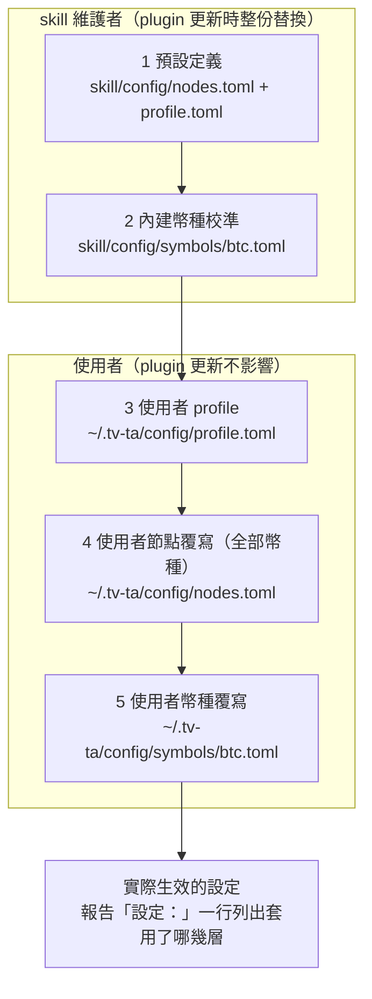
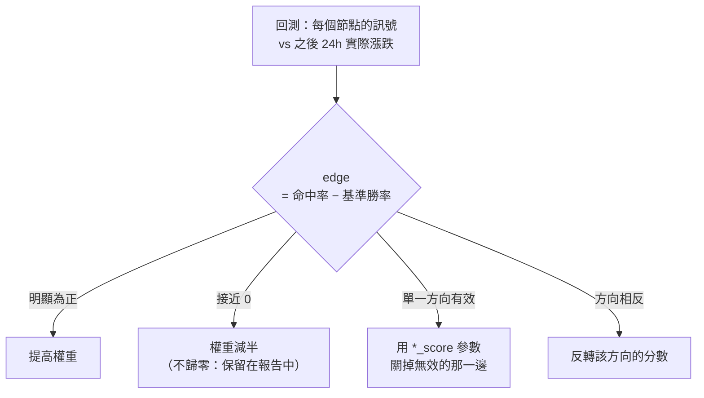
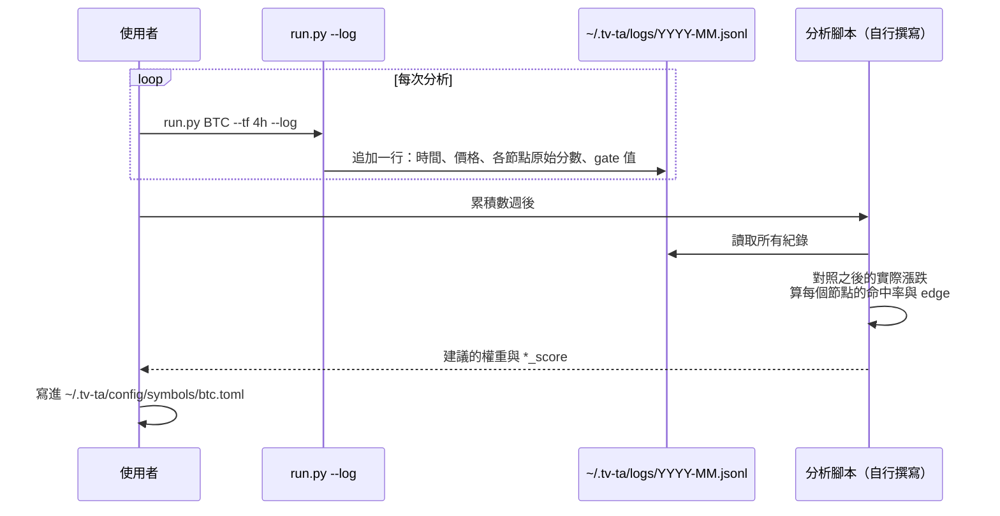
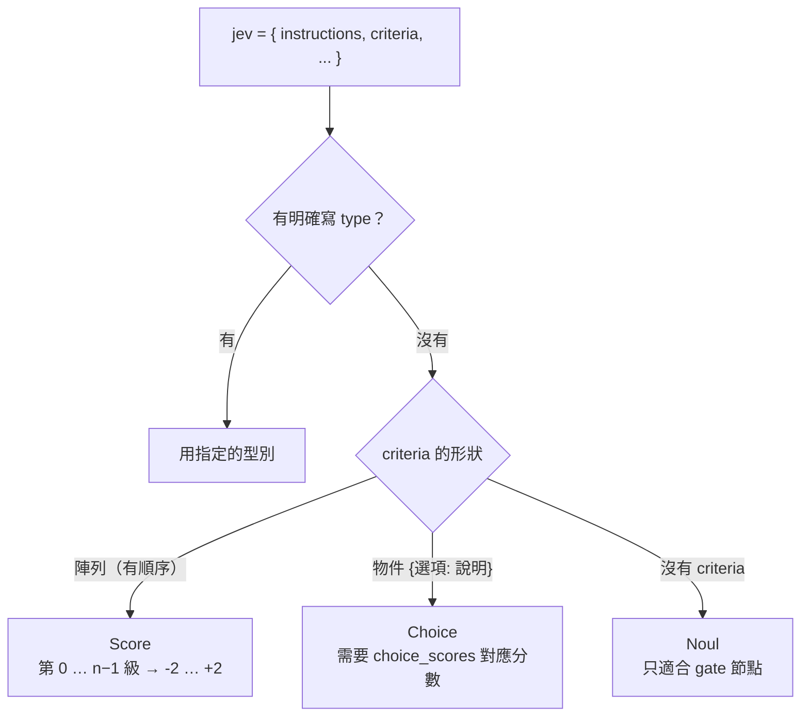
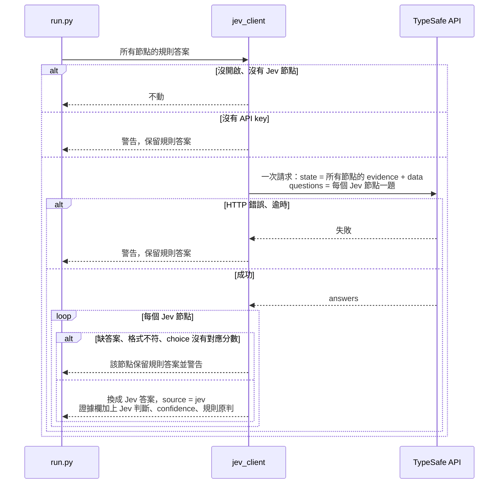
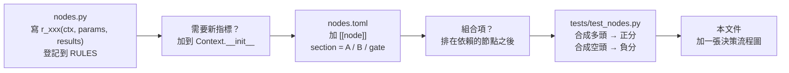

# 08 設定分層與校準

> 政策放在設定檔，不放在程式碼。設定分五層，後面蓋前面；使用者的調整放在 skill 資料夾外，plugin 更新不會蓋掉。操作面的說明在 [節點設計與調參](../../skills/tv-ta/references/node_design.md)，這裡說明設計理由。

[← 回目錄](README.md)

## 五層設定



### 合併規則

| 資料型別 | 合併方式 | 例子 |
|---|---|---|
| 表格 | 逐鍵合併 | 使用者只寫 `[nodes.rsi] params = { overbought = 75 }`，其他 RSI 參數保留預設 |
| 陣列 | 整個替換 | 使用者寫了 `[[gate]]`，就會取代全部預設 gate |
| 純值 | 替換 | `weight = 2.0` |

**設計決策**
- **使用者檔案是補丁，不是副本**：只寫想改的欄位。如果要求複製整份設定，skill 更新預設值時，使用者的舊副本會把新預設蓋掉。
- **陣列整個替換**：gate 是有順序、互相關聯的一組設定，逐項合併會產生難以預測的結果。
- **寫錯節點 id 會直接報錯**（結束代碼 2）：打錯字時靜默忽略，使用者會以為調整生效了。
- **報告一定列出套用的層**：回答「為什麼我的結果和別人不一樣」的第一步。
- **`--no-user-config`**：只跑內建預設值，方便比較。

## 為什麼要分幣種

同一個指標在不同幣種上可能有相反的意義。BTC 和 ETH 的內建校準來自 py-tvscreener 的指標回測（1h 指標值 對 之後 24 小時漲跌）：

| 節點 | BTC | ETH | 回測依據 |
|---|---|---|---|
| `uo` | 權重 **2.0**，超賣端關閉 | 預設 | BTC：UO > 70 之後偏跌 +16.6pp（最強單一訊號）；UO < 30 之後反而偏跌 |
| `rsi` | 超買 -1、超賣 0 | 權重 1.5，超買 -1、超賣 +1 | BTC：RSI > 70 偏跌 +5.2pp，超賣無 edge；ETH 兩端都有效 |
| `mfi` | 超買 -1 | 權重 1.5，超買 -1 | MFI > 80 偏跌：BTC +6.4pp、ETH +13.1pp |
| `cci` | 預設 | 上方 **-1**（反向） | ETH：CCI > 100 偏跌 +6.7pp，是均值回歸 |
| `dmi` | 權重 0.5 | 多方 **0** | BTC 接近 0 edge；ETH 的 ADX 上升趨勢反而偏跌 -9.5pp |
| `psar` | 權重 0.5 | 預設 | BTC 接近 0 edge |
| 均線類四項 | 權重 0.5 | 權重 0.5 | 交叉與排列：負或接近 0 edge |

**校準的原則**



**已知限制**：回測用的是 1h 指標對 24h 漲跌，樣本從 2026-02 起、偏多頭。校準值套用到所有級別，是「方向性的微調」，不是精確值。重新產生回測報告時要重新檢查。

## 用紀錄校準權重



**為什麼記原始分數而不是加權後的結果**：權重是要被校準的對象。只要有原始分數，就可以用任何一組權重重算歷史，比較哪組最好。這就是 [複合評分](02-typesafe-patterns.md#複合評分composite-scoring) 的好處：判斷和政策分開，政策可以事後調整。

**不必等紀錄累積**：`scripts/replay.py` 直接抓歷史 K 線，把過去每一根當成最新一根重跑，目前用來校準[信心度路由](03-decision-model.md#信心度路由用一致度降級結論)的門檻：

```
python scripts/replay.py BTC --tf 4h --bars 2000
python scripts/replay.py ETH --tf 1h --bars 3000 --thresholds 0.5,0.6,0.7 --json
```

要評估新增或恢復某個節點，用 `--compare-node <id>`：同一批 K 棒各跑一次（該節點關閉 / 開啟），並列出這個節點單獨投票時的命中率。例如 [MACD Cross](05-nodes-section-b.md#macd-cross-交叉事件macd_crossmomentum)。

回放和 `--as-of` 一樣只用當時已收盤的 K 棒。差別是 MTP 的較高級別也只用已收盤的，因為當時正在形成那根的顏色已經無法得知。

## Jev 節點

把某個節點改問 TypeSafe Jev，只需要在 `nodes.toml`（或使用者的覆寫檔）加上 `jev` 設定，並在 `profile.toml` 開啟 `[jev] enabled = true`、設定 `TYPESAFE_API_KEY`。

### 問題型別怎麼決定



- **Score 的等級必須從強烈看空排到強烈看多**：程式用線性對應 `-2 + 4 × level ÷ (n − 1)`。
- **Jev 的問題型別可以和節點原本的型別不同**：Zig Zag 在 code 規則裡是 Choice，改問 Jev 時用 Score 更自然（「結構有多清楚」是程度問題）。

### 請求與退路



**設計決策**
- **一次請求**：TypeSafe 的建議，多個問題在同一個請求中平行回答，成本和延遲都比逐題呼叫低。
- **任何失敗都退回規則**：報告永遠產生得出來。Jev 是加值，不是依賴。
- **證據欄同時列出 Jev 和規則的判斷**：使用者可以比較，也方便日後評估 Jev 是否真的比規則好。
- **只在主級別呼叫**：多級別對照和一日漲跌題都不呼叫。
- **尚未實作**：依 `confidence` 決定是否採用 Jev 答案，見 [03 的信心度路由一節](03-decision-model.md#尚未實作)。

## 新增節點的檢查清單



規則函式的約定：

- 資料不足時回傳 `Result(None, "原因")`，**不要回傳 0**。0 代表「看過了，中性」。
- `evidence` 要有具體數字，讓人能對照圖表。
- 門檻一律從 `params` 讀，並給預設值（`p.get("xxx", 預設)`），不要寫死。
- 單邊可能失效的訊號，把分數做成參數（例如 `overbought_score`），讓校準可以關掉它。
