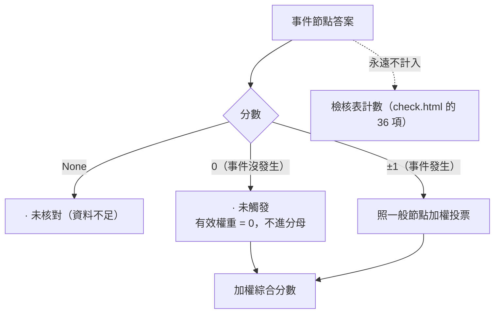

# 09 事件節點與驗證流程

> 大部分節點回答「現在是什麼狀態」（收盤在 Supertrend 上方、多頭排列）。事件節點回答「剛剛發生了什麼」（Supertrend 剛翻多、MACD 剛金叉）。事件節點放在 Section E，**每個都要先通過同一套回放驗證才會預設開啟**；目前 8 個都沒有通過，全部是 `enabled = false`。

[← 回目錄](README.md)

## 事件節點怎麼投票



**為什麼「未觸發」不當成 0 分投票**：事件大部分時間都沒發生。如果算成中性的一票，每多一個事件節點，綜合分數就被往 0 拉一點，BUY / SELL 會越來越少。第一版的 `macd_cross` 就是這樣：它本身沒有任何方向資訊，卻讓 BTC 1h 的 BUY / SELL 少了 36 次。

**為什麼不計入檢核表計數**：檢核表計數是 check.html 的規則，只涵蓋 check.html 的 36 格。事件節點不在 check.html 上，所以只參與加權綜合分數。報告的「已核對 N / 36」也不含它們。

## 目前的事件節點

| 節點 | 事件 | 參數 |
|---|---|---|
| `macd_cross` | MACD 柱狀圖在最近 3 根內由負轉正（金叉）或由正轉負（死叉） | `lookback` |
| `rsi_divergence` | 最近 3 根價格創 20 根新低但 RSI 低點墊高（底背離 +1），或反過來（頂背離 −1） | `lookback`、`recent` |
| `uo_divergence` | 同上，指標換成 Ultimate Oscillator | 同上 |
| `obv_divergence` | 同上，指標換成 OBV | 同上 |
| `supertrend_flip` | Supertrend 在最近 3 根內翻轉 | `lookback` |
| `squeeze_fire` | BB 在最近 3 根內從 KC 裡面鬆開；方向看收盤在 BB 中軌上方或下方 | `lookback` |
| `di_cross` | +DI 和 −DI 在最近 3 根內交叉；可設 ADX 下限 | `lookback`、`adx_min` |
| `structure_break` | 收盤突破前一個已確認的 Zig Zag 轉折高點，或跌破轉折低點 | `lookback`、`depth` |

所有事件都判斷**正在分析的那個級別**：`--tf 4h` 只看 4h 的交叉和翻轉。

## 驗證流程

```
python scripts/evaluate_node.py <節點 id> [...]
```

它會平行跑：

- `replay.py --compare-node`：BTC、ETH × 1h（3000 根）、4h（2000 根）、1d（1000 根），報酬看 24 小時後；
- `replay.py --updown 700 --compare-node`：BTC、ETH 最近 700 題一日漲跌題，偏向 = 開題當下 1h / 4h / 1d 綜合分數平均的正負號。

**通過標準**在看任何結果之前就寫死在 `evaluate_node.py`，避免看了結果才挑一個好看的測法：

1. **單獨有效**：節點每次投 ±1 之後，價格往同方向走的比例 ≥ 53%，前半和後半都 ≥ 50%，六組裡至少五組做到；
2. **不傷整體**：導入後，任何一組的綜合結論命中率都沒有下降超過 1 個百分點；
3. **漲跌題不變差**：導入後，BTC 和 ETH 的漲跌題偏向命中率都沒有下降。

三項全部通過才預設開啟。

## 第一輪結果（2026-09-24）

「單獨命中」= 節點投 ±1 後 24 小時價格同方向的比例。✓ = 該組達到第 1 條標準。

| 節點 | BTC 1h | BTC 4h | BTC 1d | ETH 1h | ETH 4h | ETH 1d | 達標組數 |
|---|---|---|---|---|---|---|---|
| `macd_cross` | 54% ✓ | 55% ✓ | 45% | 48% | 50% | 46% | 2 / 6 |
| `rsi_divergence` | 42% | 57% ✓ | 41% | 46% | 48% | 47% | 1 / 6 |
| `uo_divergence` | 44% | 51% | 46% | 47% | 51% | 51% | 0 / 6 |
| `obv_divergence` | 41% | 55% ✓ | 53% | 48% | 53% | 49% | 1 / 6 |
| `supertrend_flip` | 52% | 53% | 48% | 50% | 43% | 47% | 0 / 6 |
| `squeeze_fire` | 54% | 51% | 45% | 54% | 49% | 45% | 0 / 6 |
| `di_cross` | 53% | 52% | 49% | 48% | 49% | 59% ✓ | 1 / 6 |
| `structure_break` | 53% | 43% | 48% | 49% | 42% | 52% | 0 / 6 |

- **沒有一個節點通過**。命中率大多落在 45%–55%，而且同一個節點在 BTC 和 ETH、不同級別之間方向不一致。
- 有些組合明顯低於 50%（例如 `rsi_divergence` BTC 1h 42%、`structure_break` 4h 42%–43%），看起來像「反著用會有效」。**不要直接反轉**：48 組裡本來就預期有幾組因為雜訊偏離 50%，這是挑結果。要驗證反轉，得先把假設寫下來，再用這次沒用過的時間段測。
- 導入任何一個節點，綜合結論的命中率變化都在 ±1 個百分點內（只有 `uo_divergence` 讓 BTC 4h 下降超過 1pp）。
- 第 3 條的判斷用的是未四捨五入的命中率，所以表面上都是 49% → 49% 也可能判為「變差」。這一輪所有節點都已經在第 1 條就沒過，不影響結論。

完整輸出可以用 `python scripts/evaluate_node.py <id>` 重跑；K 線會更新，數字會隨時間小幅變動。

## 同時發現：目前的綜合分數對漲跌題沒有預測力

這一輪的「沒導入」欄就是目前預設設定在漲跌題上的表現：

| 幣種 | 題數 | 實際 Up 比例 | 偏向命中 |
|---|---|---|---|
| BTC | 698 | 52% | **49%** |
| ETH | 698 | 51% | **46%** |

開題當下，1h / 4h / 1d 綜合分數平均偏多就猜 Up、偏空就猜 Down，命中率低於擲硬幣。`updown.py` 預設會用這個分數把 P(Up) 修正最多 ±10pp（`profile.toml [updown]`），依這份回放，這個修正目前沒有幫助，甚至可能讓結果更差。見 [07](07-updown.md)。
