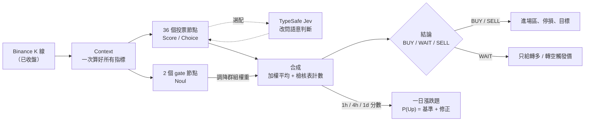

# tv-ta 設計文件

這組文件說明 [tv-ta](../../skills/tv-ta/) 的**決策設計**：每個技術指標怎麼從數值變成判斷、判斷怎麼合成結論、結論怎麼變成交易計畫，以及這些設計借用了 [TypeSafe](https://docs.typesafe.ai/) 的哪些概念、又在哪裡刻意不同。

- 想**使用** tv-ta：請看 [repo 首頁](../../README.md) 和 [tv-ta 說明文件](../../skills/tv-ta/README.md)。
- 想**調參數**：請看 [節點設計與調參](../../skills/tv-ta/references/node_design.md)。
- 想知道**為什麼這樣設計**、或要**審查規則**：看這裡。

TypeSafe 概念的中文說明可參考 [skill-typesafe-ai 中文文件](https://github.com/JacobHsu/skill-typesafe-ai/tree/main/docs/llm)，官方原文在 <https://docs.typesafe.ai/>。

## 一張圖看懂

## 文件目錄

| 文件 | 內容 | 適合誰讀 |
|---|---|---|
| [01 架構與資料流](01-architecture.md) | 從抓 K 線到印出報告的每一步、模組分工、為什麼只用已收盤 K 棒 | 第一次看程式碼的人 |
| [02 TypeSafe 設計模式對照](02-typesafe-patterns.md) | Score / Choice / Noul、複合評分、扇出、信心度門檻路由在 tv-ta 裡對應到什麼 | 想理解設計理念的人 |
| [03 決策模型](03-decision-model.md) | 加權綜合分數、gate 公式、檢核表計數、**信心度門檻路由**的實作與提案 | 要改結論門檻或 gate 的人 |
| [04 Section A 逐項決策](04-nodes-section-a.md) | `{symbol}.html` 19 項指標，每項一張決策流程圖 | 要審查或修改規則的人 |
| [05 Section B 逐項決策與 Gate](05-nodes-section-b.md) | `o/{symbol}.html` 17 項指標、2 個 gate、2 個停用節點 | 同上 |
| [06 交易計畫](06-trade-plan.md) | 進場區、停損、目標價、WAIT 觸發價怎麼挑 | 要改停損 / 目標邏輯的人 |
| [07 一日漲跌題](07-updown.md) | 題目時間換算、基準機率模型、技術面修正 | 用 tv-ta 回答預測市場題的人 |
| [08 設定分層與校準](08-config-and-calibration.md) | 五層設定怎麼合併、BTC / ETH 校準依據、用紀錄校準權重 | 要調權重或做回測的人 |
| [09 事件節點與驗證流程](09-event-nodes.md) | Section E 事件節點、未觸發不投票、`evaluate_node.py` 的通過標準與第一輪結果 | 要新增判斷規則的人 |

## 閱讀建議

- 只想知道「為什麼報告說 WAIT」：讀 [03 決策模型](03-decision-model.md) 的「三種結論」和「實例」。
- 想知道某一項為什麼是 ▲ 或 ▼：直接到 [04](04-nodes-section-a.md) 或 [05](05-nodes-section-b.md) 找該項的流程圖。
- 想加入新的判斷方式（例如用 LLM 判斷背離）：讀 [02](02-typesafe-patterns.md)，再讀 [08](08-config-and-calibration.md) 的 Jev 一節。

## 符號約定

| 符號 | 意思 |
|---|---|
| ▲ / ─ / ▼ | BUY / WAIT / SELL（單項的判定） |
| `+1`、`-2` | 節點分數，範圍 -2 到 +2 |
| ↳ | 組合項：讀取其他節點已算好的答案 |
| `params.xxx` | `config/nodes.toml` 裡該節點可調的參數 |
| 〔提案〕 | 目前程式**沒有**實作，只是設計建議 |

> 本工具的結果是依規則計算的技術面參考，非投資建議。
